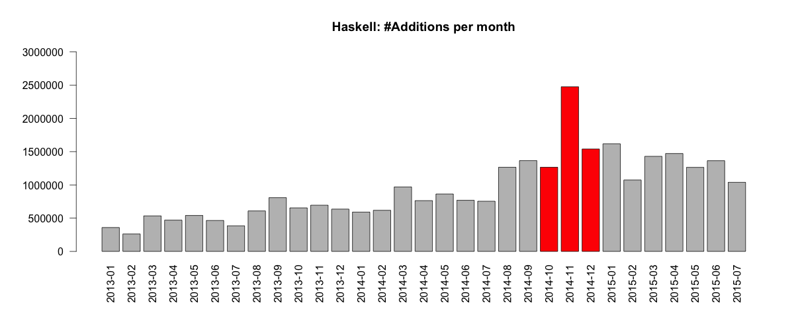
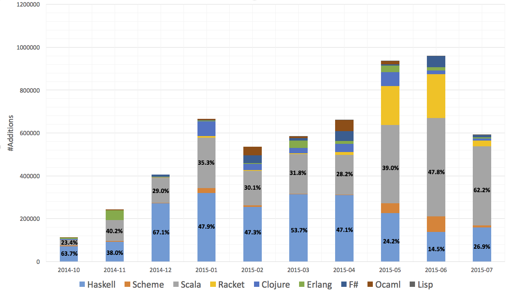

TU Delft is a very active contributor of MOOCs on the [edX platform](https://www.edx.org/), 
which are regularly taken by tens of thousands of learners across the world. One of the most (de)pressing issues of
current MOOCs are the lack of retention and the lack of engagement we observe - most learners disengage within a few days
of having started the course (if they start it at all). A lot of research in recent years has heavily focused on those learners
that disengage, ignoring those learners (in the best possible sense) that actually make it.

Instead of ignoring the engaged learners, we made them the focus of our work, exploring to what extent they 
actuall *apply* the knowledge they gained in a MOOC in a practical setting.

The paper's abstract:

>The rising number of Massive Open Online Courses (MOOCs) enable people to advance their knowledge 
>and competencies in a wide range of fields. **Learning** though is only the first step, the 
>*transfer* of the taught concepts into practice is equally important and often neglected in the investigation of MOOCs. 
>In this paper, we consider the specific case of **FP101x** (a functional programming MOOC) and the extent to which learners 
>alter their programming behaviour after having taken the course. We are able to link about one third of all FP101x learners
>to GitHub, the most popular social coding platform to date and contribute a first exploratory analysis of learner behaviour 
>beyond the MOOC platform. A detailed longitudinal analysis of GitHub log traces reveals that (i) more than **8%** of engaged 
>learners transfer, and that (ii) most existing transfer learning findings from the classroom setting are indeed applicable 
>in the MOOC setting as well. 

In other words, the majority of learners (in this specific MOOC) are not employing the skills they have acquired
in any meaningful way. This may not be too surprising, considering the complexity of functional languages and the upstart issues
developers face when they first make the move towards functional languages. However, it raises some questions regarding the 
purpose of MOOCs - if learners never apply what they have learnt, they will quickly unlearn it. 

I want to show "off" two observations we made. In this first exploration, we considered only the most basic coding 
metric - the number of lines of code added in a particular language by our learners across any of their publicly 
available Github projects. If the engaged learners we identified on GitHub are truly working through the MOOC, their GitHub projects
should reflect this. The FP101x MOOC teaches Haskell exclusively, and so we plotted the number of lines of Haskell code added by our 
learners across time:

FP101x was taught in the red period. It is a sensible result: more Haskell code is written during the course by our learners. Most interesting
though is what happens after the end of the course - Haskell enters a steady decline, it only takes a few months before pre-MOOC
Haskell programming levels are reached.

What is going on? We know that some learners did indeed transfer. 
However, those learners that stick with functional programming simply move on to other languages. Lets take a look at the
code lines added over time across a range of functional languages. In this plot, we only considered the subset of learners that had
never functionally programmed before FP101x and began programming functionally afterwards (i.e. we can be quite certain that the 
MOOC impacted their knowledge and skills):

Haskell is starting out strong during the MOOC (October 2014 to December 2014), but quickly declines and is replaced by Scala and surprisingly
Racket to some extent.