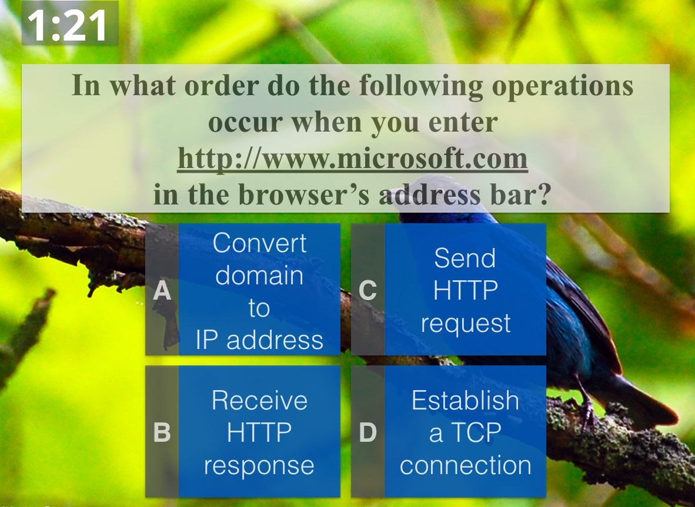
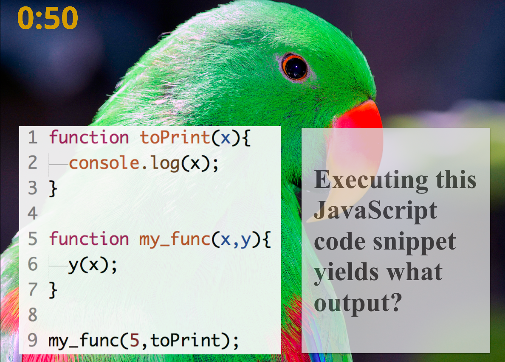
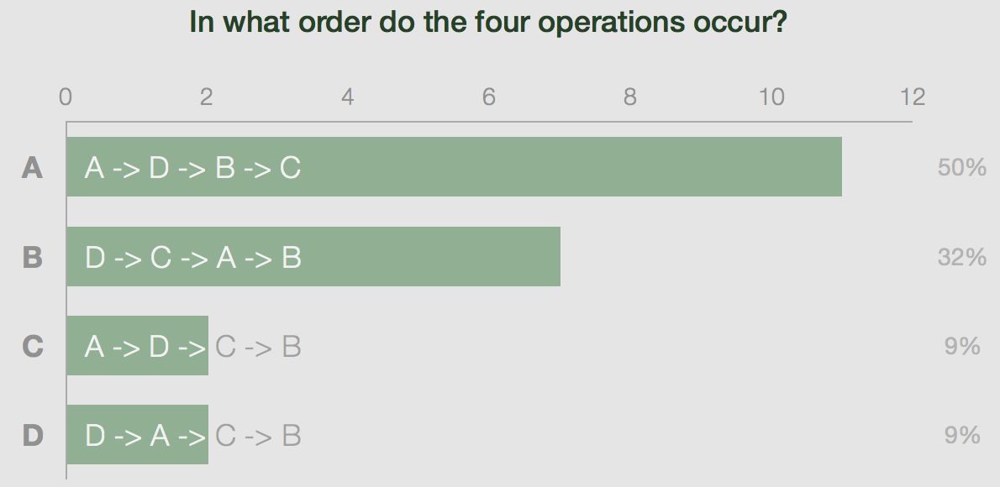
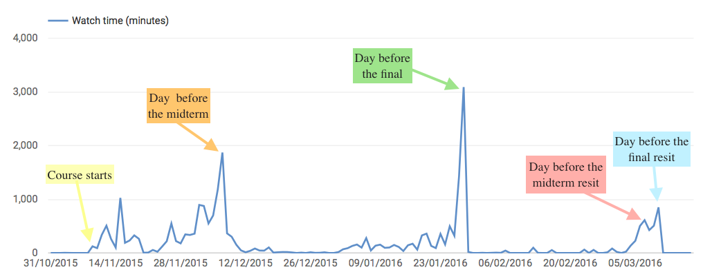
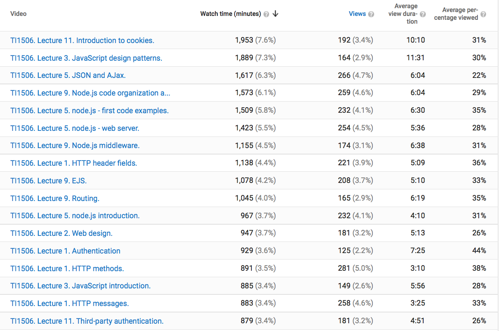
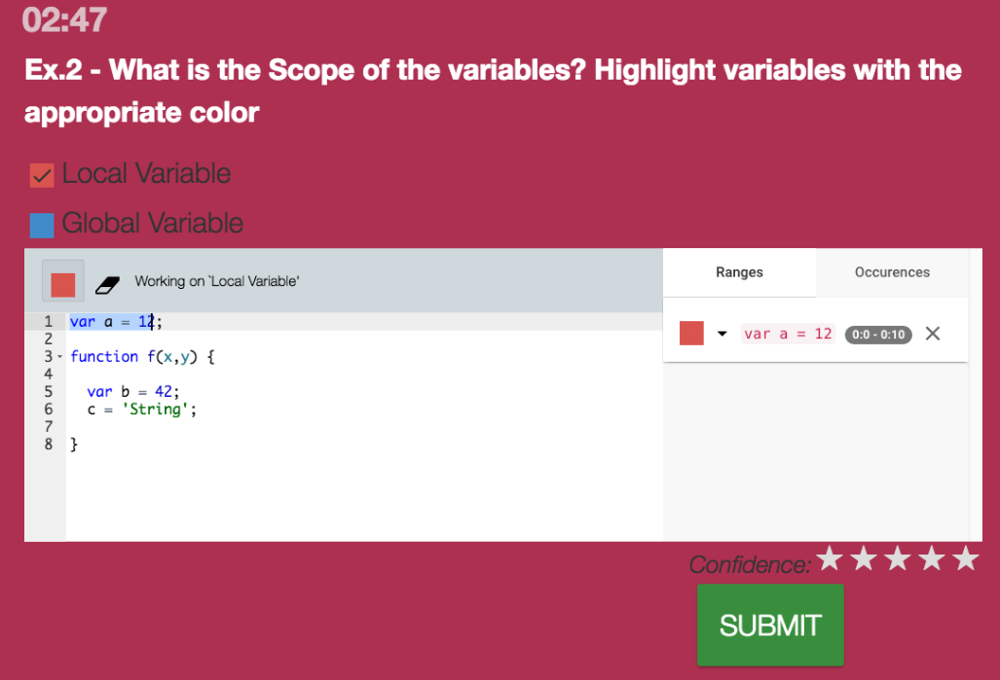
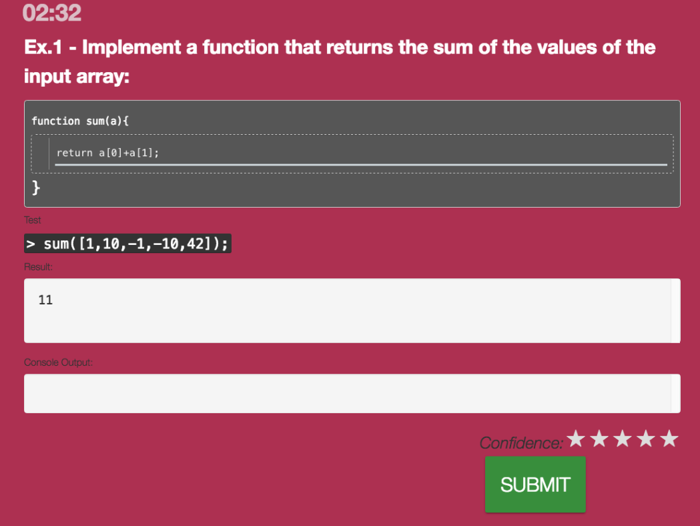
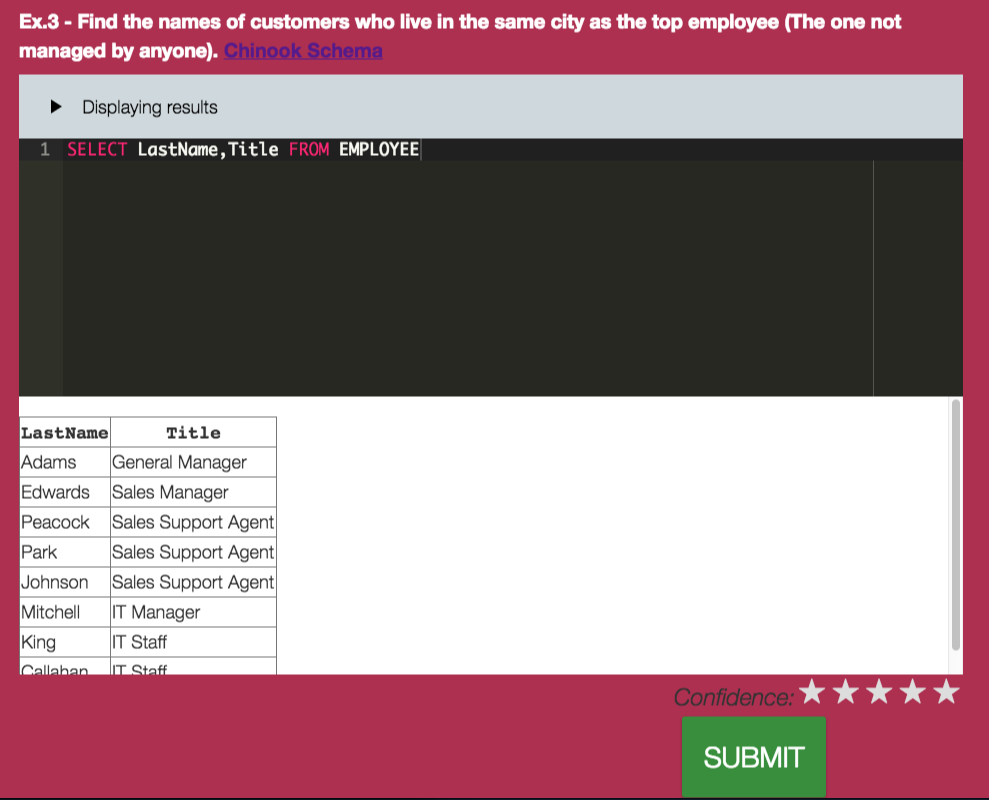
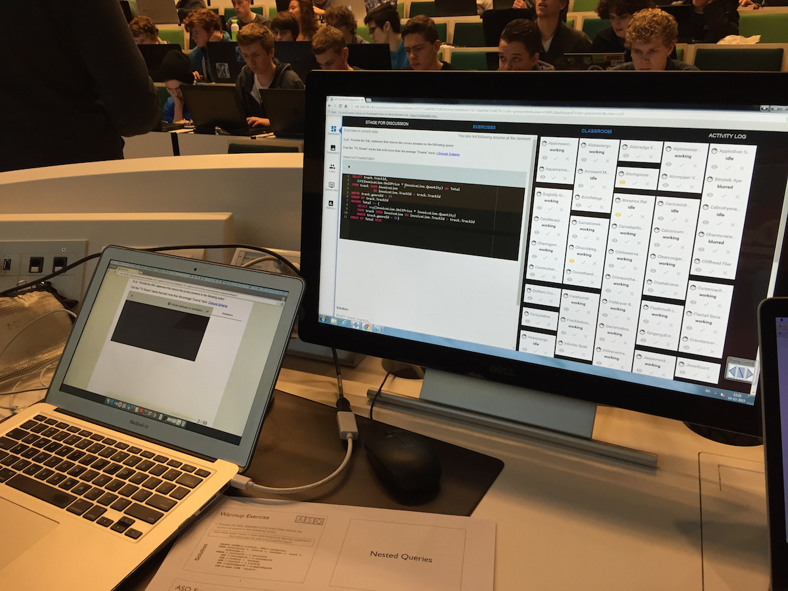
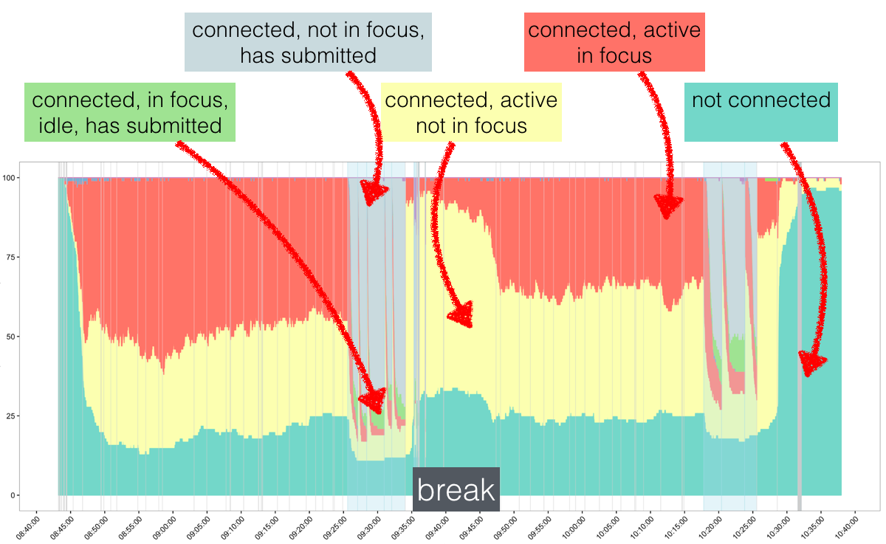

Together with my colleague [Alessandro Bozzon](http://alessandrobozzon.com/), I teach a Bachelor course 
called *Web and Database Technology* within the *Technical Computer Science* degree program at TU Delft.
The course is not only compulsory for our first year Computer Science students, but also for all those
students choosing *Software Design & Application* as their minor. 

This means that we usually have to deal with more than 300 students (the most recent edition had 320)
at once - some of whom have never written a line of HTML before, others have 2-3 years of 
JavaScript programming experience by the time they enter our classroom.

The course has a standard structure: two lectures (90 minutes each) and one 4-hour lab session per week for 
eight weeks. The midterm and final exam each account for 40% of the grade, the lab project is worth the remaining 20%. 
I teach the *Web technology* part (8 lectures).

## The problem
One aspect of large classes I continously battle with is how exactly to *engage* such a large number
of students. Nothing is worse than 300 students looking down at you (or more
likely at their laptops and smartphones) bored or completely lost 20 minutes into a 90 minute lectures. 
In the last two years I mostly relied on [FeedbackFruits](https://secure.feedbackfruits.com/) 
(a Web platform that turns any browser-enabled device into a clicker) to test the students' level 
of understanding through **multiple-choice questions**. My questions tend to look like this:

or this:

Unfortunately, I don't learn very much from the students' answers:

All I know is that 9% of the students got it right - I have no idea  **why** the rest of the class failed to answer
the question correctly. I either have the choice to take a stab in the dark and explain some of the material one 
more time or I move on to the next topic. Both options are unsatisfactory for the students and myself.
Even worse, multiple-choice questions may lead students to *think* that they know how a concept is applied (they got the answer option right!), without actually ever applying it.

In this year's edition of the course we1 addressed this issue in two ways:
+ We provided screencasts of almost all lectures: instead of simply recording ourselves during the lectures, we
created between 3 and 6 video segments per lecture. Students that were not able to follow the course should be 
able to catch up by watching the screencasts.
+ In some of the lectures we replaced FeedbackFruits with [ASQ](http://asq.inf.usi.ch/), which provides a much richer set of question types and a much richer set of realtime feedback, enabling *data analytics in the classroom* - who wouldn't want that!

So, how did we fare?

1 Whenever I use '*we*' in this post I mean the entire course, not just *my* Web technology part.

## Screencasts

Did any of the students actually watch the screencasts? I hoped so, considering the fact that attendance declined considerably over time (from >300 students at the beginning to ~180 students in the last lecture). Since we uploaded
all screencasts to YouTube, analytics are available with the click of a button. To make sense of the graph, I also
added the four (for the students) important milestones of the course: the midterm and final as well as their resits.

The trend is not what I had hoped to see: at the beginning (when almost all students attended the lectures) the students watched more screencasts without a direct incentive (a midterm/exam the next day) than in the later weeks
of the course. A month into the course, the students had settled on a strategy: to watch the screencasts one or maybe two days before the actual test. 

How many students did watch the individual screencasts? Again, YouTube's analytics dashboard has a straight answer:

None of the screencasts hits 300 views, indicating that not all students feel the need to rely on them to prepare for their tests. None of the lectures reached an average of 50% view
time (*Average percentage viewed* column). This is maybe not surprising, every MOOC video guide nowadays suggests to cut down the lecture videos to seven minutes or less (which corresponds roughly to the *Average view duration* column), whereas my screencasts are between 15 and 35 minutes long. 

The screencasts received high scores in the **student satisfaction** ratings, though based on the usage statistics I have my doubts that the students actually benefitted from them in their **learning**.

## ASQ

This is [ASQ](http://asq.inf.usi.ch/) in its own words:

>ASQ is a Web application for creating and delivering interactive HTML5 presentations. 
>It is designed to support teachers who need to gather real-time feedback from the students 
>while delivering their lectures. Presentation slides are delivered to viewers who can answer 
>the questions embedded in the slides. The objective is to maximize the efficiency of bi-directional 
>communication between the lecturer and a large audience.

The setup for the students is easy: at the beginning of the lecture I point them to a URL they open in the browser and that's it, they see the lecture slides and the embedded questions as the lecture progresses. 

### Complex questions

What made it so attractive to me is the opportunity to present complex question types *in class* to hundreds of students
and to receive *in realtime* feedback about the students' focus and their performance on the task. 
Here are three of those complex question types:

In this question the students are asked to demonstrate their *understanding* of JavaScript's concept of scope by
highlighting the variables that are local and global. Once the students are satisfied with their answer, they
submit the solution.

Here, the students have to *write* JavaScript themselves. The question contains an embedded unit test, so students can
check before submitting their answer whether it is likely to be correct. 

Students can also *write* SQL queries themselves without having to install any database. Everything runs *in* the browser, as soon as the students see the question they can start honing their SQL abilities.

The benefit for the students is high: in these questions, the students have to **apply** their knowledge. They realize very quickly when they are unable to do so (unlike in the multiple-choice setting).

ASQ is not only demanding of the student, it is also very demanding of the instructor: as soon as the students hit *submit* I get to see the all submissions on my instructor screen, which is really a non-trivial dashboard:

While the students are still working (I usually create examples that take no more than 3-4 minutes to solve) I can already scroll through the first submitted solutions and mark those I want to discuss. Since I only have 2-3 minutes to prepare myself, this can be a rather stressful few minutes. It does give me, however, an immediate feedback point and a direct view on the types of errors the students are making. At the end of the exericse, I go over the solutions I selected (usually 1 correct and 1-2 incorrect ones) and explain to the students why those are correct or incorrect.

### Realtime analytics
Apart from the direct feedback on students' understanding, ASQ also provides an overview of what the students are doing (or not doing): as any Web application, ASQ has access to the browser events the browser window ASQ is active in emits. Those events include `windowFocus`, `windowBlur`, `input`, `idle`, `active` and so on. Although these events are low-level, they can provide us with hints about what is going on. For every student who has opened ASQ, the platform collects events (anonymized, as ASQ does not require students to login). This collection of events across time and all students can lead to graphs like this one (showing how one of our lectures went): 

Not the prettiest graph (yet), I admit, but very insightful nevertheless. The lecture starts at 8:45am, has a 15 minute break between 9:30 and 9:45 and ends at 10:30. The barely visible grey lines are slide transitions and the eight spikes of certain event combinations appear when exercises were incorporated into the slides. The y-axis shows the number of students that, at each moment in time, belong to a certain category: **red** (the students are doing something with the ASQ window/tab in focus), **yellow** (the students are doing something with the ASQ window/tab *not* in focus), **green** (the students submitted the answer to an exercise and are not doing anything else) and **grey** (the students submitted the answer to an exercise and are doing something else). The break interval provides a good baseline: during the break, we see a lot of students in the yellow category and few in the red one. This should be the other way around during the lecture - although this is indeed the case, we also observe that as the lecture progresses more and more students turn from red to yellow, indicating that fewer students pay attention towards the end of the lecture. Each of the eight spikes indicates an exercise that took place, when the students suddenly "snap back" and focus on the lecture content.
ASQ can provide much more than this one analysis, I hope though, this gives a first impression on what it is all about.

### Was it worth the effort?
ASQ is not yet a product, it is a prototype and requires effort to set up locally (it is open-source). It is not as simple as replacing PDFs or Powerpoint slides with a few HTML slides. It also requires effort to create good complex questions (those you have to develop yourself). But still, it was worth it. The lectures I did with ASQ were more interactive than the rest (here I fell back on multiple choice); *I* was more comfortable lecturing, as suddenly I did not have to guess anymore what content the students had grasped, I could see it clearly in their responses to the exercises. The students enjoyed it, and they got a real sense of the knowledge they possessed (or the lack of it).

So, yes, it was worth the effort and I will be using ASQ again next year!

