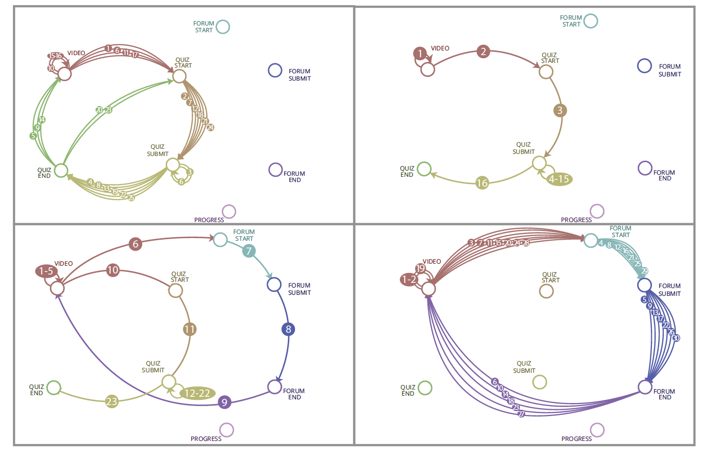
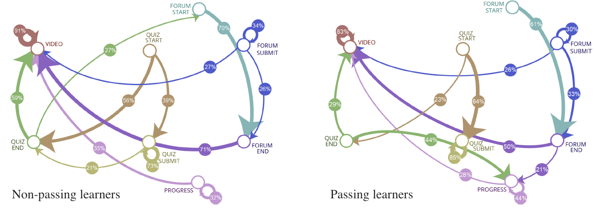

MOOCs have been around for a few years by now. Learning designers and MOOC instructors though are still grappling with how
to design *engaging* MOOCs - the low retention rates we observe across virtually all MOOCs show that there are
many people that want to learn, but few persist. A lot of past research has explored ways to predict **when**
MOOC learners will drop out of a course (under the assumption that once learners under the threat of attrition can 
be identified, something can be done to reengage them with the course), including the [2015 KDD Cup](http://kddcup2015.com/information.html).
While, the accuracy of these predictors tends to be high (70-90% accuracy depending on the amount of data available), their
*exploratory power* is low. Instructors and designers alike are unlikely to gain actionable insights from glancing at
random forests or SVN hyperplanes.

In our [EDM 2016](http://www.educationaldatamining.org/EDM2016/) paper: 

```bibtex
@inproceedings{Chen2016a,
  author = {Dan Davis and Guanliang Chen and Claudia Hauff and Geert-Jan Houben},
  booktitle = {EDM '16: 9th International Conference on Educational Data Mining},
  title = {Gauging MOOC Learners’ Adherence to the Designed Learning Path},
  pages = {...},
  year = {2016}
}
```

we take a more holistic view and investigate *visually* how
learners move through MOOCs (we call these movements **executed learning paths**) and how those movements compare to the **designed learning path** that the instructors/designers had in mind when creating the course. The paper in its own words (aka the abstract):

>Massive Open Online Course (MOOC) platform designs, such as those of edX and Coursera, afford linear learning
>sequences by building scaffolded knowledge from activity to activity and from week to week. We consider those sequences
>to be the courses' **designed learning paths**. But do learners actually adhere to these designed paths, or do they forge
>their own ways through the MOOCs? What are the implications of either following or not following the designed
>paths? Existing research has greatly emphasized, and succeeded in, automatically predicting MOOC learner success
>and learner dropout based on behavior patterns derived from MOOC learners' data traces. However, those predictions do
>not directly translate into insightful information for course designers & instructors aiming to improve engagement and
>retention - the two major issues plaguing today's MOOCs. In this work, we present a three-pronged approach to exploring
>MOOC data for novel learning path insights, thus enabling course instructors & designers to adapt a course's
>design based on empirical evidence.


## Designed learning path

Lets first take a look at the *designed learning path*. We considered four different MOOCs that ran at TU Delft
within the past two years (2x computer science, 1x business and 1x political science course); between 9K and 37K learners
registered for the MOOCs which all had pass rates below 6.5% (normal for MOOCs!). For each MOOC we visualized for one
course week the designed learning path, i.e. the path learners are supposed to take when moving through the week's course
materials (we consider the main material types that [edX](https://www.edx.org/) offers: video, quiz, and forum). 

We had anticipated the courses to have similar designed paths, but all four actually had different designs:



In the image above, each circled number indicates the step number of each transition in the week's course material sequence.
In the top-right, we have what could be called the classic xMOOC: first, the learner has to watch two videos, before
answering 10+ quiz questions. The forum is not part of the course design. In constrast, in the top-left and bottom-right
courses, we see a much larger breakup of the course material and learners are expected to cycle through the same sequence
(video-quiz in the top-left and video-forum in the bottom-right) multiple times. The bottom-left is the only course that,
by design, incorporates all course material types we consider: having watched multiple videos, the learner is first guided
to the discussion forum, before viewing another video and moving on to the quiz questions of that week. 

## Executed learning paths

You might wonder what the "Progress" nodes are doing in image above; although never part of the course design we found it 
to be a rather attractive aspect for our learners: many of them will from time to time check their progress on the 
Progress page, which brings us to the executed learning paths that learners take. For each course, we computed the
probability of a learner moving from `X` (e.g. a video) to `Y` (e.g. the start of the quiz) based on the log traces that our
learners generate. We peformed this step separately for
the learners that passed the course and those that had not, leading to the following visualization (for one of the MOOCs):



There should be an edge between every single node here, as at least one learner in each MOOC will take a path from any `X`
to any `Y`. To avoid clutter, we removed all edges that have a probability below 20%. The image above 
shows how non-passing (left) and passing (right) learners move through the course material. What do we learn from it? 
Learners that pass are much more interested in their scores (heading to the Progress page a lot) than learners that do 
not pass. Non-passers are more likely to go from quiz-start to quiz-end without actually answering any questions 
(maybe they just want a glimpse of them), whereas passing learners are more likely to start anwering questions when 
they see them. Binge watching (watching one video after another) is more prevalent among the non-passers. 

The paper (10 pages of double column insights) contains many more analyses of how the designed vs. executed learning paths differ across MOOCs and across learners. In the upcoming months we will expand our work, investigate a larger number of MOOC and explore whether those designed-vs-executed learning paths insights can aid our MOOC instructors/designers not just in a post-hoc analysis of their courses, but also on the fly, whilst running them.
