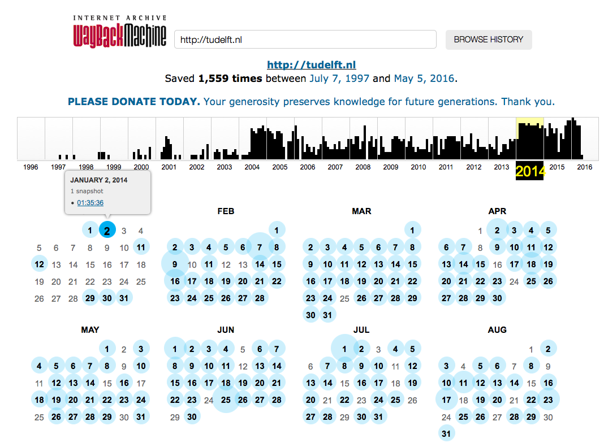
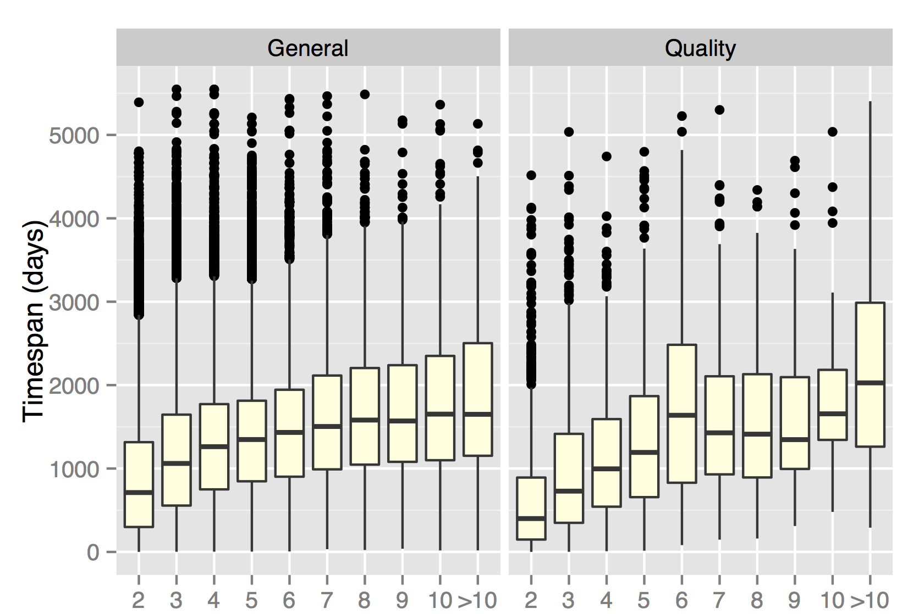

After a number of recent learning analytics papers, one of my PhD students just got a full paper accepted at
[TPDL 2016](http://www.tpdl2016.org/), analyzing the creation dynamics of "sub-documents" on the Web.

Knowing when Web document content was first created is important for a number of reasons - including many applications in
the area of *temporal information retrieval*. A simplifying assumption often made in research is that Web documents (or Web pages) were created at a single moment in time and thus have a single creation date (or timestamp). Of course we know that this is not true - Web documents are often updated and thus different parts of a Web document (we call those parts *sub-documents*) can have different creation times. 

In our upcoming paper:

```bibtex
@inproceedings{Zhao2016,
  author = {Yue Zhao and Claudia Hauff},
  booktitle = {TPDL '16: 20th Int. Conference on Theory and Practice of Digital Libraries},
  title = {Sub-document Timestamping: A study on the Content Creation Dynamics of Web Documents},
  pages = {...},
  year = {2016}
}
```

we explore to what extent this simplifying assumption of one-creation-time-per-Web-document is wrong. We analyze three
sets of Web documents from the [ClueWeb12](http://lemurproject.org/clueweb12/) corpus:

* **Quality** set: more than 7,000 Web documents that were judged relevant for 200 TREC topics (we consider those 
high-quality documents as they answer at least one information need)
* **General** set: more than 400,000 randomly sampled Web documents
* **Seen** set: more than 23,000 Web documents that we know have been seen by at least some users (those Web documents 
were randomly sampled from the portion of ClueWeb12 that was crawled in response to the URLs posted in the public Twitter 
stream at crawling time).

How do we go about finding out when the content of these Web documents was *first* created? We exploit the [Internet Archive](https://archive.org/web/)
for this purpose: it is our only way (well, unless you are a search engine provider) to look into the history of a large
part of the Web. For each sampled ClueWeb12 document we gathered all historic versions available on the Internet Archive
and then tagged each paragraph (we consider one paragraph to be one sub-document) with the timestamp of the earliest historic version containing it. To make this a bit more concrete, take a look at this screenshot from the [Internet Archive's Wayback machine](https://web.archive.org/), visualizing its preservation of TU Delft's homepage:



The URL *http://tudelft.nl* tends to be crawled once a day, and between July 1997 and May 2016 it has been crawled a total of 1,599 times - these are the historic versions we base our analysis on. 

Lets look at two specific insights (there are many more in the paper) from our work. First, **how severe is this issue of multiple
creation times actually**? Well, see for yourself:


The plot shows what percentage of documents have had their content created at 1, 2,..., 10 different points in time. Only about a third of the *Quality* set documents were created at a single point in time, meaning that our simplifying assumption is violated for the majority of Web documents we care about (those high-quality ones). The plot also shows that having more than 5 different creation timestamps is quite rare, i.e. very few documents are updated more than a handful of times.

But is this really a problem? **How much time passes between content updates**? If the content of a Web document is just created across the timespan of a few days, it shouldn't
make much of a difference to applications that rely on document timestamps. Here we only consider those documents with
multiple creation timestamps and plot the *timespan* between the earliest and latest sub-document creation time:



We partitioned the document sets according to how many different creation timestamps we found and computed the timespan between the earliest and most recent timestamp *in days*. Evidently, few documents have small timespans, the median timespan for documents of the *General* set with 2 creation timestamps exceeds 500 days (i.e. more than a year passes between updates!); in the *Quality* set, the median exceeds 300 days. As we would expect, the median timespan increases when we look at documents with 3 or more creation timestamps.

As we cannot realistically rely on the Internet Archive to analyze billions of Web documents for their creation timestamps, in the paper we also introduce an automatic approach to estimate the creation time of sub-documents. The results provide a good starting point for future work, but there is still a lot of room for improvement in terms of accuracy. The preprint is available [here](../documents/publications/TPDL2016-zhao.pdf).
