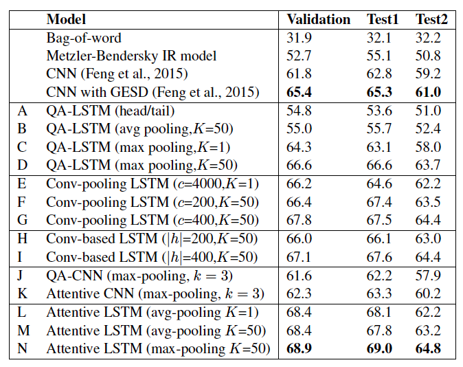
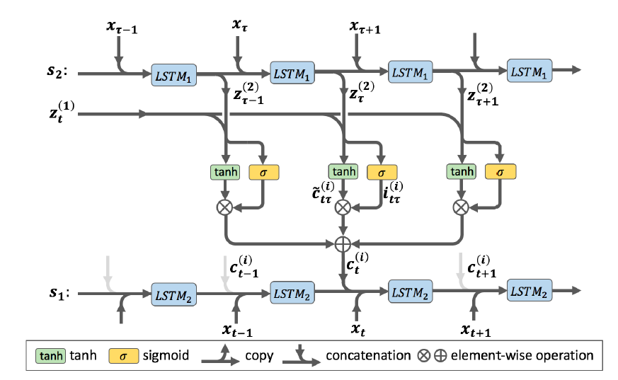

In this post, I have collected the most interesting papers I came across when attending
the [2016 Association for Computational Linguistics conference](http://acl2016.org/) - my first time at ACL.
Nowadays, a lot of computational linguistics is *deep* and correspondingly
there is a lot of interest from industry to hear what is going on and canvas the scene for potential employees. 
This interest was reflected in the number of participants: more than 1600 people had signed
up. A large number of submissions also meant a large number of accepted papers and subsequently
the program ended up with up to SEVEN parallel sessions.
Overall, 231 long papers were accepted as well as 97 short papers and 28 system demonstrations. 

The proceedings are [available online](http://aclweb.org/anthology/P/P16/). Be prepared to spend
a week browsing through them and repeatedly work through results such as this one, which shows a lot of deep learning (LSTMs are the new bag-of-words, at least in NLP) with usually one or two non-deep baselines:

Visualizations of deep nets have also become more refined, though I still have a hard time working through them:

My list of favourites is only based on the long papers, I did not have time yet to work through the short ones. Here it is:

1. Have you ever trained word embeddings yourself (using `word2vec` or `GloVe` or ...)? Have you ever thought about the **order** in which you supply the training data? Does the order matter? As shown in [*Learning the Curriculum with Bayesian Optimization for Task-Specific Word Representation Learning*](http://aclweb.org/anthology/P/P16/P16-1013.pdf) the order does matter (starting the training with simple items before complex ones works quite well) and has some impact when employing the learnt embeddings in a downstream NLP task. The paper asks an interesting question, takes an interesting approach to answer it and provides all sorts of insightful analyses.

2. The idea of *curriculum learning* (``inspired by the way humans acquire knowledge and skills: by mastering simple concepts first, and progressing through information with increasing difficulty to grasp more complex topics'') is also the starting point for the following paper: [*Easy Questions First? A Case Study on Curriculum Learning for Question Answering*](http://aclweb.org/anthology/P/P16/P16-1043.pdf). The authors show specifically for the task of question answering that good heuristics go a long way and choosing the *right* sequence of training examples can lead to substantial improvements over an uninformed baseline that receives training examples in random order.

3. In [*Query Expansion with Locally-Trained Word Embeddings*](http://aclweb.org/anthology/P/P16/P16-1035.pdf) Diaz et al. show that in the ad hoc retrieval setting, drawing terms for query expansion from **globally trained** embeddings (i.e. those readily available pre-trained models as listed [here](https://github.com/3Top/word2vec-api#where-to-get-a-pretrained-models)) performs worse than drawing terms from small, **locally trained** embeddings. And here *small* really means small: the embeddings are trained on 1000 documents; *locally* trained refers to the fact that for each query, the training documents are probabilistically drawn from the set of documents with a high query likelihood score. The good news for the global embeddings crowd though is, that both *local* and *global* embeddings improve over the query likelihood baseline across all three evaluated corpora.

4. [*DocChat: An Information Retrieval Approach for Chatbot Engines Using Unstructured Documents*](http://aclweb.org/anthology/P/P16/P16-1049.pdf) is one of the few works at the conference that use IR technology to solve an NLP task: **automated short text conversations**. Modern conversational agents usually use one of two approaches to reply to a user's utterance: (1) finding the best utterance-response pair from the training data, or (2) generating a response using deep learning sentence generation techniques. The authors explore a third approach: (3) using learning to rank to rank potential response sentences from a set of documents in reply to an utterance. While it sounds rather straight-forward, it is not: the feature engineering going on in the paper is tremendous (and it is of course deep). Based on the description I'd imagine a language generation model to be easier to set up, train and tune than this. On the bright side, the feature engineering work was not in vain: the evaluation showed *DocChat* to be state-of-the-art.

5. An interesting task was proposed in [*How Much is 131 Million Dollars? Putting Numbers in Perspective with Compositional Descriptions*](http://aclweb.org/anthology/P/P16/P16-1055.pdf). Given a statement such as ``Water is flowing into Taihu lake at a rate of 150 cubic meters per second`` the authors' system automatically generates a perspective to make the scale of the numeric mention more understandable, e.g. ``That's about how much water would flow from a tap left on for a week``. The paper describes the entire pipeline, starting with dissecting the task into several componenets and ending with an exhaustive human-centred evaluation. 

6. [*Latent Predictor Networks for Code Generation*](http://aclweb.org/anthology/P/P16/P16-1057.pdf). This rather boring title hides the fact that the authors used a source code dataset generated from **Magic the Gathering** and **Hearthstone** game implementations. It deserves a mention just for that fact.
 
7. [*A short proof that O_2 is an MCFL*](http://aclweb.org/anthology/P/P16/P16-1106.pdf). A **ten page proof** - the only of its kind in the proceedings and thus interesting in its own right and included here.

8. [*Generating Factoid Questions With Recurrent Neural Networks: The 30M Factoid Question-Answer Corpus*](http://aclweb.org/anthology/P/P16/P16-1056.pdf). As the title implies, the paper describes by far the largest publicly available natural language question-answering corpus and its generation from Freebase facts (not hard to guess that neural machine translation makes a prominent appearance here). The conducted human evaluation found the generated questions to be undistinguishable from real human-generated questions. The corpus is available for download [here](http://agarciaduran.org/).

9. One of the problems of word embeddings is the fact that they are word-based. For some tasks embeddings of larger units make more sense - one of those tasks is the **Semantic Textual Similarity** task (at SemEval): given two sentence A and B, estimate their similarity to each other. One easy way to generate a sentence embedding is to compute the word embedding of all words of the sentence and average them (and subsequently the similarity between two sentences is the cosine similarity of their embeddings' vectors). That works okay. Since the task (sentence similarity) is known, it should be better to though to optimize the embeddings for the task, instead of relying on task-agnostic word embeddings. In [*Siamese CBOW: Optimizing Word Embeddings for Sentence Representations*](http://aclweb.org/anthology/P/P16/P16-1089.pdf) this problem is tackled by generating embeddings at the sentence level by slightly altering the CBOW model. The empirical results are impressive, clearly a lot is to be gained by moving away from word embeddings ignorant of the downstream application.

10. Embeddings were a core theme of ACL this year, here is another one: [*Learning Word Meta-Embeddings*](http://aclweb.org/anthology/P/P16/P16-1128.pdf). Instead of trying to alter the existing embeddings models and training new embeddings from scratch, the authors explored the power of combining publicly available pre-trained embeddings, to learn what they call 'meta-embeddings'. The way the authors ensemble meta-embeddings from pre-trained embeddings allows nearly any pre-trained model to be included: it does not matter what algorithms were used for training, which corpora were employed or what the embedding dimensions are. The results are positive as well, the ensembled embeddings (or meta-embeddings) outperform the single-source embeddings on various NLP tasks.
 
11. [*Learning Language Games through Interaction*](http://aclweb.org/anthology/P/P16/P16-1224.pdf). One of those papers I included due to their quirkyness - in the most positive sense of the word. The authors cite [Wittgenstein's language games](https://en.wikipedia.org/wiki/Language-game_(philosophy)) as their inspiration and implemented a game ([check out their demo](http://shrdlurn.sidaw.xyz/)) in which a human player has to teach the computer a language. Crowdworkers played the game and the authors then analyzed the teaching strategies the players employed. Pretty insightful to see how the crowdworkers tackled this problem and quite a direct 'implementation' of Wittgenstein's idea.

12. [*Generating Natural Questions About an Image*](http://aclweb.org/anthology/P/P16/P16-1170.pdf) is another paper that explores a novel task: **Visual Question Generation** (VQG). When given an image, a VQG system should generate a *natural* and *engaging* question. Here is how the authors distinguish this task from a standard computer vision task: "Asking a question that can be answered simply by looking at the image would be of interest to the Computer Vision community, but
such questions are neither natural nor engaging for a person to answer and so are not of interest for the task of VQG". It turns out that this is a very hard task and definitely not solved as of yet. 

13. [*Strategies for Training Large Vocabulary Neural Language Models*](http://aclweb.org/anthology/P/P16/P16-1186.pdf) - the authors are all from Facebook and thus have plenty of experience with large-scale model training. The paper empirically analyzes training strategies for neural language models. To quote one of the findings: "Overall, differentiated softmax and hierarchical softmax are the best strategies for large vocabularies." A good read for people struggling to make reduce the training time.

14. Wouldn't it be great, given a piece of source code (probably undocumented) to have a system that takes the source code as input and generates a natural language description of it?  This is exactly what was attempted in[*Summarizing Source Code using a Neural Attention Model*](http://aclweb.org/anthology/P/P16/P16-1195.pdf) for SQL and C# code snippets. The authors make clever use of StackOverflow to collect enough training data for their deep model and (not surprisingly) find it to be superior to all non-deep baselines. My only gripe is the description of their "information retrieval baseline" - computing the Levenshtein distance between two pieces of text is not really IR.

15. Lastly, [*Unravelling Names of Fictional Characters*](http://aclweb.org/anthology/P/P16/P16-1203.pdf) is another piece of work which explores a question I had never even thought about: can we predict a fictional character's role (good or bad) simply based on the sound and form of the fictional character's *name* (and nothing else)? The authors are able to creatively think of a suprising number of hypotheses and based on those, generate 28 distinct features. They find phonological features to be most indicative of a character's polarity and report precision and recall values above 0.8! Now, somebody has to make the next step and move this analysis from the fictional into the real world.

