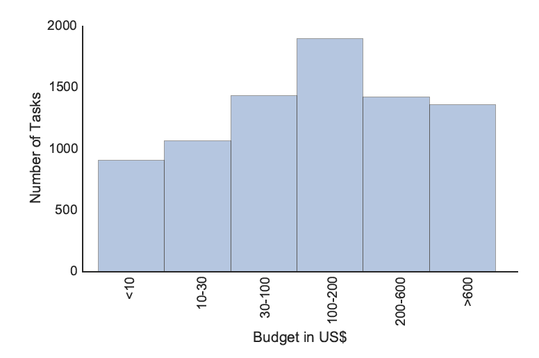

MOOCs aim to ``educate the world.'' More often than not, however, MOOCs fall short of this
goal — a majority of learners are already highly educated and come from specific parts of the (developed) world. Learners from developing countries without a higher degree are underrepresented, though desired, in MOOCs. 

One reason for those learners to drop out of a course can be found in their financial realities and the subsequent limited amount of time they can dedicate to a course besides earning a living. If we could **pay** learners to take a MOOC, this hurdle would largely disappear. With MOOCS, this leads to the following fundamental challenge: *How can learners be paid at scale?* Ultimately, we envision a recommendation engine that recommends tasks from online market places such as [Upwork](https://www.upwork.com/) or [witmart](http://www.witmart.com/) to learners, that are **relevant** to the course content of the MOOC. In this manner, the learners learn *and* earn money. 

To investigate the feasibility of this vision, in a recently accepted journal article in the [IEEE Transactions on Learning Technologies](https://www.computer.org/web/tlt)

```bibtex
@article{Chen2016c,
  author = {Guanliang Chen and Dan Davis and Markus Krause and Efthimia Aivaloglou 
            and Claudia Hauff and Geert-Jan Houben},
  journal = {IEEE Transactions on Learning Technologies},
  title = {Can Learners be Earners? Investigating a Design to Enable MOOC Learners to Apply their 
           Skills and Earn Money in an Online Market Place},
  pages = {...},
  year = {2016}
}
```
we explored:

+ To what extent online market places contain tasks relevant to a specific MOOC, and 
+ to what extent learners are able to solve **real-world tasks** *correctly* and with sufficient *quality*. 


## You paid your learners???

In this first study, we did not actually pay learners (that would be a great follow-up though!), instead we inserted ``bonus exercises'' drawn from paid tasks posted on [Upwork](https://www.upwork.com/) into the MOOC *Data Analysis: Take it to the MAX()*, which teaches basic data analysis skills using spreadsheets (lookup and search functions, array formulas, named ranges, etc.). The MOOC was one of the more popular ones at TU Delft with 33,515 registered learners of which less than 7% completed the course successfully (this low number is in line with similar MOOC offerings).

As we aim to determine whether learners can solve real-world tasks that are related to the course material with high accuracy and quality, for each course week we manually selected one appropriate paid task from Upwork, limited to those paying between US $20-$50; we fixed these limits as we wanted the tasks to be meaningful but also solvable in a reasonable amount of time. We kept the task descriptions intact, let our learners solve the tasks and had a spreadsheet expert generate the ground truth solution against which we compared all solutions sent in by our leaners. We also identified a number of relevant [code smells](https://en.wikipedia.org/wiki/Code_smell) that we employed to measure the *quality* of the submissions. 


## Are learners able to solve these tasks?

Yes they are! Well, those that try at least are. In the table below, we show for each course week the number of active learners (those that are still following the course), the number of learners that submitted a solution to the weekly bonus exercise and most importantly, the number of accurate (i.e. in line with the ground truth) and high quality (no code smells) solutions. 


The progression through the course weeks is typical for a MOOC: in week 1 learners are still highly motivated and 16% submitted a solution to our Upwork-based bonus exercise, by week 7 we were down to 1% of learners. Interestingly, the accuracy of the solutions is not correlated with the amount of pay for task - the two lowest paid tasks ended up being the tasks with the lowest percentage of accurate solutions (when we looked at the results we found that the lengthy descriptions threw learners off and they often missed one of the required data processing steps). 
Positive to mention is the quality of the solutions, a large fraction of the solutions exhibited zero code smells!

## How scalable is all of this?

Does Upwork actually have sufficient tasks to support thousands of learners with course-relevant tasks? We looked into this question by taking a snapshot of all available tasks on Upwork on a specific day in September 2015 - this led to a total of 56,308 open tasks that we analyzed. 

Among all open tasks, about 8,000 have a fixed budget (instead of an hourly rate or a specific contract length) which can be binned according to their budget as follows:



About 2,500 tasks fall into our budget range of up to US $50. However if we filter out all those that are *not* relevant to spreadsheets we are left with only 574 *potentially relevant* tasks in the budget range $1-$50. We manually labelled a sample of those tasks for their relevance to the taught MOOC material. Based on this labelling we estimate that for this particular MOOC and our budget constraints 11 *relevant* tasks are added *every day* to Upwork. This is better than nothing, but clearly not enough. In the future we will consider additional freelance platforms, tasks with larger budgets (which may be split across learners) and setups that will aid MOOC leanrers to take the first actual steps into the paid freelance task world.

## Where can I read more about this?

In the preprint, up in a few days!
