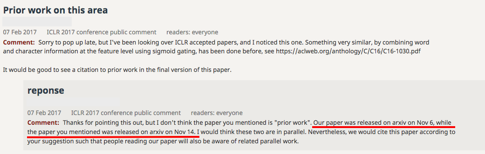

Deep learning has been *the* dominant theme in a number of research communities (e.g. computer vision, natural language processing) for the past few years. In *information retrieval* (IR), things are moving more slowly, we are still experimenting with word embeddings and are only beginning to adapt the (by now) classic CNN and RNN architectures to our needs. One reason is the lack of good data sources, in particular in academia. One major source of information for IR researchers are query logs. Existing query logs though are either very old (the [infamous](https://en.wikipedia.org/wiki/AOL_search_data_leak) AOL query log is from 2006) or very small. And "small" does not go together well with deep networks. Slow movement does not mean no movement though; last year's ACM SIGIR conference (one of the major information retrieval conferences) saw the inception of the first [Neural Information Retrieval Workshop](https://www.microsoft.com/en-us/research/event/neuir2016/) and [Chris Manning](https://nlp.stanford.edu/manning/) during his SIGIR keynote urged us all to get on board the deep net train (or else it will leave without us).

I have been interested in deep learning for quite some time and when this year's [International Conference on Learning Representations](http://iclr.cc) (ICLR for short) was announced to be in France, and thus pretty close to home, I had to be there. And indeed, here I am. 

The conference is dominated by Google/Google Brain/DeepMind and Montreal - it is hard to find papers where none of the authors has an affiliation to one of those organisations. Dominant topics are [GANs](https://en.wikipedia.org/wiki/Generative_adversarial_networks), program generation, scalability issues, compression, reinforcement learning and (oddly to me) textures. The conference runs an interesting submission process: all submissions are *public* at submission time and *non-blind*. Reviewers (who are anonymous) and chairs also perform the review in public and anyone who is interested can comment on any submission at any time. Authors are invited to change their submissions in response to reviewer comments. Authors (anyone really) can also comment on the reviews. And even though the conference is in full swing, the whole process is still publicly available at the [OpenReview website](https://openreview.net/group?id=ICLR.cc/2017/conference) (it may take 1-2 minutes to load on a slow machine). What should also be mentioned is the fact that many authors concurrently with the submission (or before) post their work on [arXiv.org](https://arxiv.org/) as in deep learning research weeks or even days count to claim ownership of an idea as this comment-reply examples illustrates:

All of this [can lead to pretty heated arguments - in public - between authors and reviewers](https://openreview.net/forum?id=BkjLkSqxg&noteId=BkjLkSqxg). Submissions that are rejected from the conference track may be accepted in the [workshop track](https://openreview.net/group?id=ICLR.cc/2017/workshop). The conference itself revolves mostly around poster sessions, each of the three conference days has up to seven presentations (invited talks plus a few selected papers) and about 100 posters spread over two poster sessions of two hours each. It is quite a challenge to take a meaningful look at even half the posters in that time! For completeness, the conference has this year awarded a *best paper award* to the following three papers: [1](https://openreview.net/forum?id=BkbY4psgg&noteId=BkbY4psgg), [2](https://openreview.net/forum?id=HkwoSDPgg&noteId=HkwoSDPgg) and [3](https://openreview.net/forum?id=Sy8gdB9xx&noteId=Sy8gdB9xx).

The following list contains a rundown of the papers in both the workshop and conference track that I liked and found interesting (given my perspective as an academic IR researcher). Personally, I found the workshop track papers more accessible, many of the conference track papers where way over my head. 

1. [Adversarial Examples in the Physical World](https://openreview.net/forum?id=HJGU3Rodl&noteId=HJGU3Rodl) is a paper that fits into the "research is fun" category by creating physical adversarial examples. In the words of the abstract: "An adversarial example is a sample of input data which has been modified very slightly in a way that is intended to cause a machine learning classifier to misclassify it." The common way to generate such adversarial examples it to slightly change  a digital item. That (by now) is pretty common. But what about creating adversarial examples from physical objects, here demonstrated with physical *printouts* of images? If that sounds convoluted, take a look at the authors' demo on [YouTube](https://www.youtube.com/watch?v=zQ_uMenoBCk&feature=youtu.be) and focus on the top of the mobile screen which shows what object the machine learner recognizes in each printout.

1. [Diet Networks: Thin Parameters for Fat Genomics](https://openreview.net/forum?id=Sk-oDY9ge&noteId=Sk-oDY9ge) describes an approach to cutting down on the number of parameters in deep nets for use cases where the number of input features is magnitudes larger than the number of training examples. Insufficient number of training examples is something any IR person should be able to relate to! 

1. [Automatic Rule Extraction from Long Short Term Memory Networks](https://openreview.net/forum?id=SJvYgH9xe&noteId=SJvYgH9xe) tackles a topic that I think deserves more attention, especially from a practical point of view: the interpretation of deep nets, in particular here LSTMs. Just training a model that yields high accuracy is often not enough - we should also be able to understand what the model learnt and why it makes certain decisions. 

2. [Pruning Filters for Efficient ConvNets](https://openreview.net/forum?id=rJqFGTslg&noteId=rJqFGTslg) is one of quite a few papers that propose clever techniques to reduce the computational costs of deep nets. 

3. [Learning Graphical State Transitions](https://openreview.net/forum?id=HJ0NvFzxl&noteId=HJ0NvFzxl) was one of the very few oral presentations - the vast majority of papers were "only" presented as posters. It is written by a sole author (Daniel Johnson) and on top of that the sole author is an undergraduate student! Amazing. The proposed model is able to construct and modify graph structures based on textual input (and use the graphs to generate textual output); the program chairs called the model ``quite complex'' in their acceptance decision and yes, the paper looks the part. The idea works extremely well on the [bAbI](https://research.fb.com/downloads/babi/) tasks. I am sure at least some IR tasks can also benefit from such structured intermediate representation.

17. [Words or Characters? Fine-grained Gating for Reading Comprehension](https://openreview.net/forum?id=B1hdzd5lg&noteId=B1hdzd5lg) shows that it is beneficial for downstream tasks to intelligently combine word and character level representation based on certain word properties (derived from POS tags, NER).

2. [Compact Embedding of Binary-coded Inputs and Outputs using Bloom Filters](https://openreview.net/forum?id=rySCp-1Yg&noteId=rySCp-1Yg) does exactly what the paper advertises and is a simple way to decrease a neural network's model size. 

4. [Snapshot Ensembles: Train 1, Get M for Free](https://openreview.net/forum?id=BJYwwY9ll&noteId=BJYwwY9ll): anybody who has ever participated in a [Kaggle competition](https://www.kaggle.com/competitions) or read [Kaggle's winners' interviews](http://blog.kaggle.com/category/winners-interviews/) will inevitably have heard all about ensembles and how useful they are to build robust and high quality machine learners. In deep learning ensembles are not yet common, due to the high computational costs in the training of a single deep net. This paper shows a clever trick of how to arrive at ensembles of deep nets without additional training costs! And as one could expect those ensembles are doing better than single nets.

15. [Outrageously Large Neural Networks: The Sparsely-Gated Mixture-of-Experts Layer](https://openreview.net/forum?id=B1ckMDqlg&noteId=B1ckMDqlg): the title does not lie, this is a Google paper where models with more than 100 billion parameters are trained. If you have a GPU cluster at hand, that will come in handy!

5. [Learning End-to-End Goal-Oriented Dialog](https://openreview.net/forum?id=S1Bb3D5gg&noteId=S1Bb3D5gg) is a neat contribution that alters the goalpost in dialogue systems. In the words of the pc chairs: "Most dialog systems are based on chit-chat models. This paper explores goal-directed conversations, such as those that arise in booking a restaurant. While the methodology is rather thin, this is not the main focus of the paper. The authors provide creative evaluation protocols, and datasets."

6. [Efficient Vector Representation for Documents through Corruption](https://openreview.net/forum?id=B1Igu2ogg&noteId=B1Igu2ogg) deals with some of the major limitations (lack of efficiency) of doc2vec; the proposed method is not only faster but also works better than doc2vec. 

7. [A Simple but Tough-to-beat Baseline for Sentence Embeddings](https://openreview.net/forum?id=SyK00v5xx&noteId=SyK00v5xx) is another approach to embedding longer sequences of text. The title says it all.

8. [Neural Architecture Search with Reinforcement Learning](https://openreview.net/forum?id=r1Ue8Hcxg&noteId=r1Ue8Hcxg): from time to time I happen to review papers at IR conferences that use deep nets. More often than not, I do not see any arguments for the chosen deep net architecture and it seems the net just appeared out of thin air. Now this paper could be an answer to engineering good architectures. In the words of the authors: "In this paper, we use a recurrent network to generate the model descriptions of neural networks and train this RNN with reinforcement learning to maximize the expected accuracy of the generated architectures on a validation set. On the CIFAR-10 dataset, our method, starting from scratch, can design a novel network architecture that rivals the best human-invented architecture in terms of test set accuracy."

9. [Dataset Augmentation in Feature Space](https://openreview.net/forum?id=HyaF53XYx&noteId=HyaF53XYx): as training deep nets requires a large amount of data, the image community has quickly found that creating copies of a training image by cropping/scaling/rotating it works well. The same cannot be said about the "text community" - what is the equivalent of rotating an image in the text domain? We don't know. According to this paper, we don't actually need to know: instead, we should create additional training items by performing simple transformations in the feature space (instead of the input space). Maybe a way for the IR community to augment our sadly looking sets of 50+ queries?

10. [Towards an automatic Turing test: Learning to evaluate dialogue responses](https://openreview.net/forum?id=Sk7c3yVYg&noteId=Sk7c3yVYg) is an interesting proposal for replacing a humanly interpretable evaluation metric (BLEU in this case) with a deep net for the case of dialogue evaluations. While I do not like an evaluation metric to be a black box, the authors unarguably show their net's superior correlation with human judgments. This is one of the few NLP works in the conference, I wonder how this work would have been received at EMNLP or ACL.

11. [Do Deep Convolutional Nets Really Need to be Deep and Convolutional?](https://openreview.net/forum?id=r10FA8Kxg&noteId=r10FA8Kxg) In the words of the authors: "Yes, they do." A must-read.

12. [Learning to Query, Reason, and Answer Questions On Ambiguous Texts](https://openreview.net/forum?id=rJ0-tY5xe&noteId=rJ0-tY5xe) tackles the problem of a conversational agent probing a user for missing information in order to solve a task. Sounds like an agent we need in search engines to probe the user on some missing information to move from queries to underlying information needs!

13. [A Compare-Aggregate Model for Matching Text Sequences](https://openreview.net/forum?id=HJTzHtqee&noteId=HJTzHtqee) is included here as one of the few NLP works - it proposes a deep (of course!) technique to align to input sequences with each other.

14. [Semantic Embeddings for Program Behaviour Patterns](https://openreview.net/forum?id=BJ_X2yHFe&noteId=BJ_X2yHFe) is included to show the breadth of applications in this conference: the task here is to detect malicious software based on program execution logs. This is also one of a small number of works that focus on embeddings (instead of truly deep nets).

16. [Query-Reduction Networks for Question Answering](https://openreview.net/forum?id=B1MRcPclx&noteId=B1MRcPclx) proposes a "simple" (a word the PC chairs use a lot in their decisions) recurrent network architecture for question answering. 

18. [Paleo: a Performance Model for Deep Neural Networks](https://openreview.net/forum?id=SyVVJ85lg&noteId=SyVVJ85lg): one of the issues when starting to use deep nets is a lack of familiarity with how long things take and how much things cost (if you run it in the cloud). Paleo provides answers to these questions by computing a performance model for a wide variety of software and hardware choices common in deep learning. [A live demo is available, try it out!](https://talwalkarlab.github.io/paleo/)

19. [DeepCoder: Learning to Write Programs](https://openreview.net/forum?id=ByldLrqlx&noteId=ByldLrqlx) is a deep technique to generate code from input/output examples via a specifically designed domain specific language. Right now this work is still in its infancy, so far deep nets are able to code up programs for the easiest problems on programming competition websites.

20. [Learning a Natural Language Interface with Neural Programmers](https://openreview.net/forum?id=ry2YOrcge&noteId=ry2YOrcge) is another papers that generates code; the use case though is very different: given a natural language question (e.g. "What is most populous country?") and a (database) table (e.g. drawn from Wikipedia), the deep net generates an SQL query that is able to answer the question by running it against the table. So far, this has only been tested for single table questions, I'd be interested in how well this approach does over more complex questions requiring multiple joins. 

21. I end this overview with [Dance Dance Convolution](https://openreview.net/forum?id=HyzsgBEtg&noteId=HyzsgBEtg), a quirky paper (with a quirky title) that takes a raw audio track and produces a step chart for the Dance Dance Revolution game. How cool is that! Bonus points for demoing it right besides their poster! Edward Grefenstette took an action shot: 

<blockquote class="twitter-tweet" data-lang="en">
Best <a href="https://twitter.com/hashtag/ICLR2017?src=hash">#ICLR2017</a> demo: Dance Dance Convolution <a href="https://t.co/LoBWr7Avch">pic.twitter.com/LoBWr7Avch</a>
&mdash; Edward Grefenstette (@egrefen) <a href="https://twitter.com/egrefen/status/856853198203695105">April 25, 2017</a></blockquote>

