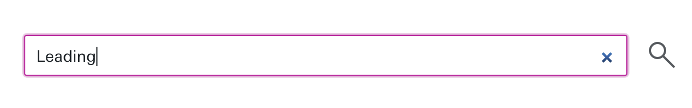
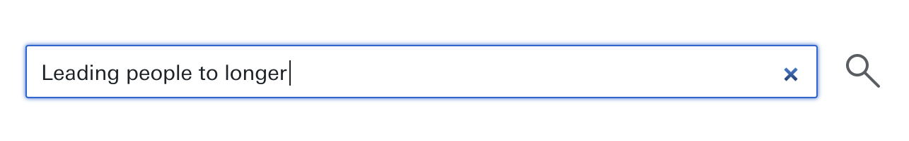
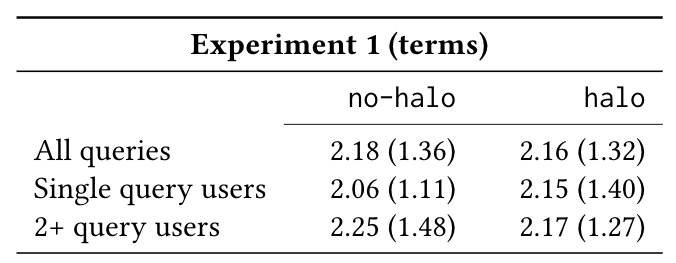

I read papers. A lot of them. Most of them conference papers. 
SIGIR, ACL, EMNLP, CIKM, WWW, WSDM, CHI, ... I try to at least browse through the
published abstracts every year. Some of those papers stick with me for a long time, because the idea 
is quirky, the approach is interesting or the results are surprising. One of those papers is
[Leading people to longer queries](http://dl.acm.org/citation.cfm?id=2481418) from CHI 2013. It asks
an intruiging question: is it possible to entice people to write longer (Web search) queries by
altering the query box with a halo or glow as queries get longer?

Does this halo:



motivate you to write a longer query until it turns into this?



In the original paper, the answer was a tentative yes, but the approach was only tested in a lab setting,
with particularly complex topics drawn from [A Google a Day](http://www.agoogleaday.com/), which are manually
designed to require a number of searches. The participants were MTurkers who had to solve three different
search puzzles (and "puzzles" is the right word here):

1. How many churches were built by the architect of the world's first triple-domed cathedral (and his office) after the Great Fire of London?
2. What tree does a mammal with fingerprints (primates excluded) rely on for food?
3. What material fuses with lime and soda to create an item on your dinner table that's considered to be an amorphous solid?

I admire the creativity of whoever designed those puzzles, but it is clear that these topics are not what any
normal searcher is having in mind when searching. 

In our [SIGIR 2017](http://sigir.org/sigir2017) short paper:

```bibtex
@inproceedings{Hiemstra2017,
  author = {Djoerd Hiemstra and Claudia Hauff and Leif Azzopardi},
  booktitle = {SIGIR '17: 40th International ACM SIGIR Conference on Research and Development in Information Retrieval},
  title = {Exploring the Query Halo Effect in Site Search},
  pages = {...},
  year = {2017}
}
```

So, we asked ourselves: can this finding of a "halo effect" 
be *reproduced* in a more natural Web setting? In particular, we implemented the halo effect on the site
search engine of the University of Twente, a federated search engine based on 35 resources including Google's site search,
local courses, local news, the telephone directory as well as the university's social meedia feeds (Twitter, Flickr and Facebook).
We deployed versions of the halo in an A/B test setup across a 50-day period. Overall, in that period the most popular
queries (not query terms!) were the following: *minor*, *matlab*, *library*, *css* and *eduroam*. That may already give
you a hint at how this experiment turned out.

In one of our experiments we considered the most basic question:

**Does the query halo effect lead people to longer queries in a naturalistic setting?**

In January 2017, in the `no-halo` condition (users see the standard query box) 884 different users submitted 1,623 
queries to our site search engine. In the `halo` condition (users see the query box with a halo enabled),
803 users submitted 1,367 queries. Lets look at the results:



The results show that on average `no-halo` queries are 2.18 terms long (standard deviation of 1.36) while in the `halo` 
condition the average almost indistinguishable with 2.16. So no, in our natural Web search setting, we were not able to
reproduce this good-looking lab study.
