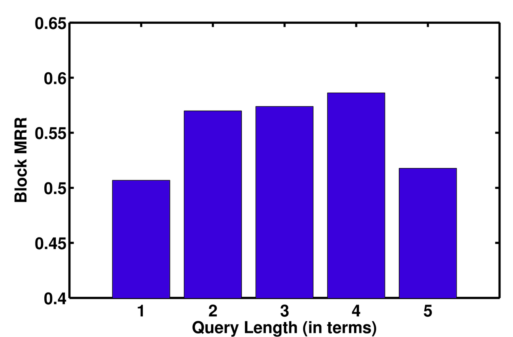

I read papers. A lot of them. Most of them conference papers. 
SIGIR, ACL, EMNLP, CIKM, WWW, WSDM, CHI, ... I try to at least browse through the
published abstracts every year. Some of those papers stick with me for a long time, because the idea 
is quirky, the approach is interesting or the results are surprising. One of those papers is
[Leading people to longer queries](http://dl.acm.org/citation.cfm?id=2481418) from CHI 2013. It asks
an intruiging question: *is it possible to entice people to write longer (Web search) queries by
altering the search box with a halo or glow as queries get longer?*

More to the point, does this halo around the search box:


motivate you to continue typing until the search box turns blue?


In the original paper, the answer was yes, but the approach was only tested in a *lab setting*,
with particularly complex topics drawn from [A Google a Day](http://www.agoogleaday.com/). Those
**search puzzles** were specifically designed to require a number of searches to find the answer. 
The participants were [Mechanical Turk workers](https://www.mturk.com/mturk/welcome) who had to solve the following
three puzzles:

 *How many churches were built by the architect of the world's first triple-domed cathedral (and his office) after the Great Fire of London?*

 *What tree does a mammal with fingerprints (primates excluded) rely on for food?*

 *What material fuses with lime and soda to create an item on your dinner table that's considered to be an amorphous solid?*

I admire the creativity of whoever designed those puzzles, but it is clear that these topics are not what any
normal searcher is having in mind when searching. In the study all queries by the participants - some receiving the halo search box and some not - were logged and analyzed. Participants in the halo condition did indeed write significantly
longer queries. But ... this was a lab study ... on topics that are not very representative of the real world.

Together with [Djoerd Hiemstra](http://wwwhome.ewi.utwente.nl/~hiemstra/) (the person behind [Searsia](http://searsia.org/) which powers the [UTwente site search](https://search.utwente.nl/)) and [Leif Azzopardi](http://www.strath.ac.uk/staff/azzopardileifdr/) we asked ourselves: **can this finding of a "halo effect" be *reproduced* in a more natural Web setting?** Our answer to this question is published in our [SIGIR 2017](http://sigir.org/sigir2017) short paper:

```bibtex
@inproceedings{Hiemstra2017,
  author = {Djoerd Hiemstra and Claudia Hauff and Leif Azzopardi},
  booktitle = {SIGIR '17: 40th International ACM SIGIR Conference on Research and Development in Information Retrieval},
  title = {Exploring the Query Halo Effect in Site Search},
  pages = {...},
  year = {2017}
}
```

In particular, we implemented the halo effect in the UTwente site search engine, a federated search engine based on 35 resources including Google's site search,
local courses, local news, the telephone directory as well as the university's social media feeds (Twitter, Flickr and Facebook).
We deployed different versions of the halo in an A/B test setup across a 50-day period. Overall, in that period the most popular queries (not query terms!) were the following: *minor*, *matlab*, *library*, *css* and *eduroam*. That may already give you a hint at how this experiment turned out...

In our main experiment we investigated whether the `halo` indeed changed users' querying behaviour. To give you a few numbers, in January 2017, in the `no-halo` condition (users are given the standard search box) 884 different users submitted 1,623 queries to the site search engine. In the `halo` condition (users are given the search box with a halo enabled),
803 users submitted 1,367 queries. Lets look at the impact of the condition on the query length:


The results show that on average `no-halo` queries are 2.18 terms long (standard deviation of 1.36) while in the `halo` 
condition the average almost **indistinguishable** with 2.16. If we dig deeper into our data and distinguish between returning
users and users submitting a single query only in that period (bottom two rows), we also do not observe any effect of the halo on user behaviour.

As a sanity check we also investigated whether our site search engine produces the best results for 1-2 term queries (in which case users may be reluctant to create longer queries), however this is not the case:



Here, we plotted how well queries of a certain length perform in (block) mean reciprocal rank. Higher is better. We observe that queries of lengths 4 perform best, queries of length 5 or more lead to a strongly degrading system performance. So yes, it would have made sense for our users to create longer queries (at least longer than 2 terms).

Overall, we were not able to reproduce the good looking lab results in a natural Web setting. This is a pity. We were able though to contribute to the growing number of reproducibility studies. I hope there will be more.
