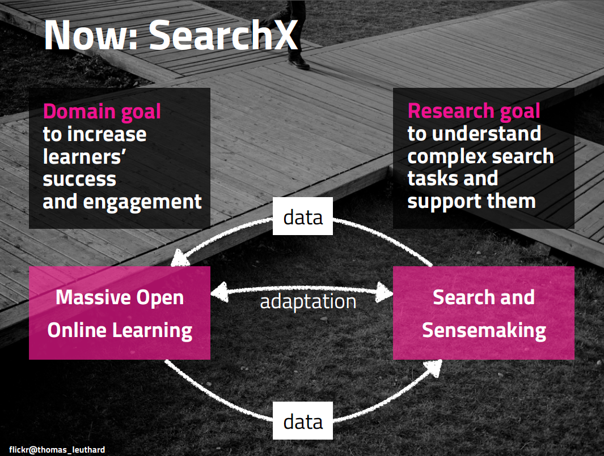

## NWO VIDI Awarded

The [Netherlands Organisation for Scientific Research](http://www.nwo.nl/en) has just announced the [proposals](https://www.nwo.nl/en/research-and-results/programmes/Talent+Scheme/awards/vidi+awards/vidi+awards+2016#physical)
that will receive funding through the [NWO VIDI](https://www.nwo.nl/en/funding/our-funding-instruments/nwo/innovational-research-incentives-scheme/vidi/index.html) scheme. I made it onto this list! The VIDI is a personal grant worth 800K € which translates into 2 PhD and 1 postdoc positions and more research time for me over the next five years. 
My proposal **SearchX: Integrating search and sensemaking into large-scale open online learning** has two goals:

* *Domain goal*: To significantly increase learners' engagement and success in online learning through the design of
novel search-based and search-informed learning interventions.
* *Research goal*: To significantly increase our understanding of complex search tasks which at this point in time is quite fragmented through the design of a battery of large-scale and longitudinal experiments exploring the main facets that define complex search tasks. In IR this research direction is also known as *search as learning*.

and two sub-projects (1 PhD/project) which are in sync with those two goals:

* *Complex search for learning* will explore the information needs associated with learning and how to
support them.
* *Beyond the MOOC platform* will explore interventions that are informed by data (user-generated
search logs) from outside the online learning platform.

Alternatively expressed in shiny grant interview slide:

## Complex Search for Learning

In this sub-project search takes the center stage with the promise that a better search experience informed by
learners' activities on the learning platform will enable them to learn more efficiently and as a consequence be
more successful. The observation and analyses of MOOC learners’ behaviors and actions in a standard search
system embedded into MOOCs provides the foundation for our two approaches to improve complex
search: personalization of search results and search interface components based on learners' abilities and context.

## Beyond the MOOC Platform

In this sub-projec the focus shifts to the learning aspect itself and how it can be informed by learners' search activities. In recent years, research focusing on large-scale learning has gained tractio. However, despite many ongoing efforts, retention rates and learner engagement remain low. I believe the main reason for this lack of progress
resides in the type of interventions explored in MOOCs today: interventions tend to be well-grounded in
educational theories and educational psychology but lacking in (technological) ambition; examples
include the use of questionnaires to recommend learning strategies, the distribution of badges to
encourage learner participation or formative in-video quizzes. None of these examples radiate an ambition to "upset" and alter the existing MOOC course design. Unsurprisingly then, an often reported outcome of these studies is a lack of engagement with the introduced interventions by a large percentage of MOOC learners. In this sub-project we explore computational approaches to infinite assessment at scale (using IR technologies), the augmentation of learner models with search log traces (to develop more adaptive MOOCs) and metrics to measure learning.

## Project Execution

The research themes explored in both sub-projects require considerable engineering effort. The developed novel
interventions and SearchX components will be open-sourced and deployed and evaluated in a "living lab", an evaluation paradigm which has gained significant traction in IR.
It offers a principled way to integrate users (MOOC learners) in the research process and enables research
collaborations that are aware of the data and privacy issues surrounding user-generated traces. All research
conducted in this project will be mixed methods, combining qualitative and quantitative empirical approaches.
All engineered components will be deployed in randomized controlled trials in at least two MOOCs in order to
provide generalizable insights. 

## Why SearchX?

`SearchX` is maybe not the most catchy title, but it is quite relevant. Large-scale open online learning refers of course to MOOCs, which TU Delft has plenty of. All our MOOCs are provided through [edX](https://www.edx.org/) and accordingly TU Delft adopted the [DelftX](https://www.edx.org/school/delftx) name. Overall, `edX+DelftX+search = SearchX`

