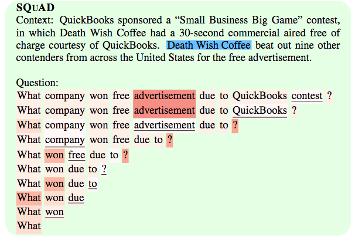

Once a year, I try to attend an NLP or ML conference, usually picking the one that is closest in terms of location.
In 2016 I was at [ACL in Berlin](https://chauff.github.io/2016-08-12-acl2016/) :de:, in 2017 I attended 
[ICLR in Toulon](https://chauff.github.io/2017-04-25-iclr2017/) :fr: and this year I made the trip to [EMNLP in Brussels](http://emnlp2018.org/) :belgium:.

EMNLP is short for *Conference on Empirical Methods in Natural Language Processing* and arguably, this conference
is most closely related to my own research area IR. As almost all reputable ML/NLP venues, the conference had a record number of
submissions (>2100) and participants (~2500) this year. Overall, 549 papers were accepted and split between oral and poster sessions.
Everything happened in parallel (not just oral sessions, but also poster sessions), apart from they keynotes and 
best paper session, which means i missed about 90% of everything that was out there.

Before the 3-day conference itself, there were two days of workshops and co-located conferences. I attended the 
[Search-Oriented Conversational AI workshop](https://scai.info/) and the [BlackboxNLP workshop](https://blackboxnlp.github.io/).
Each one had several hundred participants, with many great talks! 

I was impressed that, despite the focus on the empirical work (or maybe because of it?), many presentations were void
of almost any formula - which is quite a contrast to SIGIR or CIKM where it sometimes seems like a challenge to put in
as many formulas as possible.

What I also took away from the conference is that, often, **IR baselines** (which seems to be the way of referring to anything IR-ish) are used as poorly performing baselines whose effectiveness is well below even the worst deep models. I have only seen a few presentations and certainly have not looked at more than a small share of the papers, but this slide sums up pretty well what I perceive as a not so uncommon opinion in the NLP community:


EMNLP does have an IR/text mining track, nothing stops us from pushing back on this narrative!

The EMNLP proceedings can be found [here](https://aclanthology.coli.uni-saarland.de/events/emnlp-2018).

Here are the works that stood out to me, these tended to be either papers about conversations and dialogues, papers with a strong IR component or dataset papers:

1. [Ranking Paragraphs for Improving Answer Recall in Open-Domain Question Answering](https://aclanthology.coli.uni-saarland.de/papers/D18-1053/d18-1053). Question answering is typically a two-step process: (1) a retrieval round to get an initial list of documents and (2) a reading comprehension approach to zoom in on the answer to the input question. *"However, since  traditional information retrieval systems are not effective in obtaining documents with a high probability of containing answers, they lower the performance of QA systems."* The authors' solution: rank paragraphs instead. One of the datasets used in this paper is **CuratedTREC**, which I have heard a few times at EMNLP, still not sure what exactly that refers to. But at least one TREC dataset is popular in the NLP community!

2. [Deep Relevance Ranking Using Enhanced Document-Query Interactions](https://aclanthology.coli.uni-saarland.de/papers/D18-1211/d18-1211). This work proposes several extensions of the *Deep Relevance Matching Model* (DRMM), which outperform another recent deep learning IR model (PACRR). The paper is nicely argued for and the model looks good (PACRR is to my knowledge one of the best deep IR models), however, the model's effectiveness on the TREC Robust 2004 corpus is not great: the best MAP reported is 0.27 (with BM25 trailing at 0.24 and PACRR at 0.26) while the original TREC run submissions in 2004 [reached 0.33](https://trec.nist.gov/pubs/trec13/papers/ROBUST.OVERVIEW.pdf). This is a general issue with deep models in IR (that I am also guilty of), we tend not to look beyond BM25 baselines. Especially the initial TREC run results are still very tough to beat today, even with all the deep goodness!

3. :trophy: [How Much Reading Does Reading Comprehension Require? A Critical Investigation of Popular Benchmarks](https://aclanthology.coli.uni-saarland.de/papers/D18-1546/d18-1546). A award-winning short paper that takes a very critical look at reading comprehension models and datasets. In its own words: *"Many recent papers address reading comprehension,  where examples consist of (question, passage, answer) tuples. Presumably, a model must combine information from both questions and passages to predict corresponding answers. [...] we establish sensible baselines for the bAbI, SQuAD, CTB, CNN and Who-did-What datasets, finding that question- and passage-ONLY models often perform surprisingly well."*

4. [Pathologies of Neural Models Make Interpretations Difficult](https://aclanthology.coli.uni-saarland.de/papers/D18-1407/d18-1407). This paper explores the impact of input reduction on neural models' confidence and importance weighting of input features. The image :point_down: is an example from the paper. 
SQuAD is a well-known machine reading comprehension dataset. Here, the *Context* is the text (with the correct answer in blue) and the *Question* is ... well, the question. The red highlights indicate the importance of each question term for the model. Initially, the feature importance makes intuitive sense (*advertisement* is the most important input term), however, once iteratively the most unimportant terms (underlined) are removed from the input, *advertisement* also becomes a victim of this input reduction and in the end only *What* is left, which the model uses to predict the answer with high confidence. A great paper that critically looks at the intuitive visual manner we have come up with to explore neural models in NLP.

    

4. :trophy: [MultiWOZ - A Large-Scale Multi-Domain Wizard-of-Oz Dataset for Task-Oriented Dialogue Modelling](https://aclanthology.coli.uni-saarland.de/papers/D18-1547/d18-1547). The NLP community values dataset papers. This one describes how a *"fully-labelled collection of [10k] human-human written conversations spanning over multiple domains and topics"* has been collected and annotated. An impressive amount of work required to push the boundaries of data-driven conversational agents.

5. [A strong baseline for question relevancy ranking](https://aclanthology.coli.uni-saarland.de/papers/D18-1515/d18-1515). Having complained about weak IR baselines, I had to include this paper. It actually uses Google's search engine ranking as *IR baseline* and manages to beat it on two SemEval community question answering tasks!

6. [Word Mover's Embedding: From Word2Vec to Document Embedding](https://aclanthology.coli.uni-saarland.de/papers/D18-1482/d18-1482): an efficient approach to creating sentence and document embeddings in an unsupervised fashion. Should be very useful for a number of IR tasks!

7. [NPRF: A Neural Pseudo Relevance Feedback Framework for Ad-hoc Information Retrieval](https://aclanthology.coli.uni-saarland.de/papers/D18-1478/d18-1478). This is as far as I am aware the only out of 550 papers at EMNLP that covers pseudo-relevance feedback. The proposal is enticing: an *"end-to-end neural PRF framework"*. This time, two TREC datasets are used, one of them being Robust 2004. BM25 is the only non-deep baseline and again, while this model outperforms BM25 and PACRR, with a MAP of 0.27 it does not come near the original TREC runs submitted in 2004.

8. [Is it Time to Swish? Comparing Deep Learning Activation Functions Across NLP tasks](https://aclanthology.coli.uni-saarland.de/papers/D18-1472/d18-1472). Great title and a thorough empirical evaluation. In the authors' own words: *"we perform the first large-scale comparison of 21 activation functions across eight different NLP tasks. We find that a largely unknown activation function performs most stably across all tasks, the so-called penalized tanh function."* 

9. [Speed Reading: Learning to Read ForBackward via Shuttle](https://aclanthology.coli.uni-saarland.de/papers/D18-1474/d18-1474). Another great title (which makes sense after having read the abstract)! The authors take inspiration from human speed reading to efficiently process text by adapting a standard LSTM (which can now skip text when moving over it, but also backtrack if need be). Compared to a standard LSTM, the accuracy improves slightly for a range of NLP tasks, more importantly though is the achieved speed-up (it tends to be twice as fast as a vanilla LSTM)! If you have few GPU resources, this one is worth to consider!

10. [What Makes Reading Comprehension Questions Easier?](https://aclanthology.coli.uni-saarland.de/papers/D18-1453/d18-1453). Another paper that takes a critical look at machine reading comprehension datasets and argues for a split of the datasets into easy and difficult questions. So ... not only do NLP conferences publish dataset papers, but also subsequent critics of dataset papers which in turn lead to novel dataset papers resolving those critical points.

11. [Commonsense for Generative Multi-Hop Question Answering Tasks](https://aclanthology.coli.uni-saarland.de/papers/D18-1454/d18-1454). This is a paper that shows the sheer engineering effort (in the best sense of the word) required to solve question answering tasks that require reasoning; the authors designed a model *"to reason, gather, and synthesize disjoint pieces of information within the context to generate an answer"* to a question. The paper also shows that we still have a long way to go in terms of accuracy.

12. [Open Domain Question Answering Using Early Fusion of Knowledge Bases and Text](https://aclanthology.coli.uni-saarland.de/papers/D18-1455/d18-1455). This is another work, which is very relevant to IR. It considers open-domain question answering, for which methods so far have either consider text or knowledge bases. This work combines both sources in a single model (graph convolutions!).

13. [Generating More Interesting Responses in Neural Conversation Models with Distributional Constraints](https://aclanthology.coli.uni-saarland.de/papers/D18-1431/d18-1431). A recurrent theme at EMNLP this year was the difficulty of sequence-to-sequence models to generate more than dull/repetitive/non-informative responses (*I don't know* was a popular response) when trained on conversational data. Here, the authors add constraints to the model to keep it from responding in a dull fashion. To train and test their model, they used OpenSubtitles, a large-scale movie subtitle dataset that appears a popular and freely available dataset to train conversational models. Training the model on this dataset leads to the conversation :point_down:. I for one would like to have a conversation with that agent!

    - Source: 
        ```
        'm han solo, captain of this vessel. who 's in charge then?
        ```
    - True response: 
        ```
        'm ben kenobi. luke starkiller here is leading our expedition.
        ```
    - Generated response by the new model: 
        ```
        i am captain kirk commander of the ship
        ```

14. [Spider: A Large-Scale Human-Labeled Dataset for Complex and Cross-Domain Semantic Parsing and Text-to-SQL Task](https://aclanthology.coli.uni-saarland.de/papers/D18-1425/d18-1425). This is a paper I would have expected to see at ICRL, as in last year's edition, this sort of text-to-program task and datasets were very popular. The paper does exactly what the title suggests: it presents a dataset (10K questions, 6K unique complex SQL queries on 200 databases)and tests a number of existing sequence-to-sequence models that take a piece of text and generate an SQL query from it. Here is an example data item :point_down:.

    - Text: 
        ```
        What are the name and budget of the departments 
        with average instructor salary greater than the 
        overall average?
        ```
    - SQL: 
        ```sql
        SELECT T2.name, T2.budget
        FROM instructor as T1 
        JOIN
         department as
        T2 ON T1.department_id = T2.id 
        GROUP BY
         T1.department_id
        HAVING
         avg(T1.salary) > 
        (SELECT avg(salary) FROM instructor)
        ```
This is a hard task: the best model achieves less than 20% accuracy on the *Extra Hard* SQL queries (the more SQL keywords a query contains the harder it is).

15. [Generating Natural Language Adversarial Examples](https://aclanthology.coli.uni-saarland.de/papers/D18-1316/d18-1316). Adversarial examples are a popular research theme in the computer vision community, where the change of a few pixels per image can lead to deep nets completely misclassifying the image, while to us humans it looks unchanged compared to its original. In NLP, things are not as simple - changing a single word in a document can change the semantics significantly. Here, the authors have come up with a way to be adversarial in the text domain while ensuring that the semantics remain the same by . Here is an example from the paper :point_down:, where the original text is classified correctly as being of negative sentiment by the trained model, but the adversarial one is classified as being of positive sentiment.

    - Original (**negative**): 
        ```
        This movie had terrible acting, terrible plot, and terrible 
        choice of actors. (Leslie Nielsen ...come on!!!) the one part 
        I considered slightly funny was the battling FBI/CIA agents, 
        but because the audience was mainly kids they didn’t understand 
        that theme.
        ```
    - Adversarial (**positive**): 
        ```
        This movie had horrific acting, horrific plot, and horrifying 
        choice of actors. (Leslie Nielsen ...come on!!!) the one part 
        I regarded slightly funny was the battling FBI/CIA agents, 
        but because the audience was mainly youngsters they didn’t 
        understand that theme.
        ```

16. [WikiConv: A Corpus of the Complete Conversational History of a Large Online Collaborative Community](https://aclanthology.coli.uni-saarland.de/papers/D18-1305/d18-1305). Another dataset paper that must have cost the authors insane amounts of work. Reconstructing conversations (and not just statements, but also actions such as deleting commentaries, changing the wording of a piece of text) held on Wikipedia's talk pages at this fine-grained level provides us with data for potentially many different types of research (the authors tackle two: linguistic coordination and moderation of toxic behaviour). 

17. [Training Millions of Personalized Dialogue Agents](https://aclanthology.coli.uni-saarland.de/papers/D18-1298/d18-1298). The presentation for this paper contained the slide I photographed with the really, really poor *IR baseline* (it is tf-idf...). Another impressive data collection effort, in order to make dialogue systems less dull and more engaging. One option for that is to create *text personas* that provide a *personalized back-story to the model*. Instead of hand-crafting back-stories, the authors extracted 700 million conversations from Reddit and created 5 million personas from them. In order to test how good the sequence-to-sequence models (and the IR baseline) are, the models had to identify the correct response (among 100) of their persona to a given conversation starter. Interesting idea, but I think IR models can do better!

18. [HotpotQA: A Dataset for Diverse, Explainable Multi-hop Question Answering](https://aclanthology.coli.uni-saarland.de/papers/D18-1259/d18-1259). Another massive dataset creation effort, coordinated by the who is who of NLP and DL (Yoshua Bengio, Ruslan Salakhutdinov, William W. Cohen and Christopher D. Manning). In the words of the authors: *"Existing question answering (QA) datasets fail to train QA systems to perform complex reasoning and provide explanations for answers. We introduce HOTPOTQA, a new dataset with 113k Wikipedia-based question-answer pairs [...] that requires reasoning over
multiple  documents."*. The data is available [here](http://hotpotqa.github.io/) and comes with a learderboard!

19. [Possessors Change Over Time: A Case Study with Artworks](https://aclanthology.coli.uni-saarland.de/papers/D18-1251/d18-1251). This is the paper that probably tackles the most specific task I have seen at EMNLP this year. In the words of the authors: *"This paper presents a corpus and experimental results to extract possession relations over time. We work with  Wikipedia articles about artworks, and extract possession relations along with temporal information indicating when these relations are true."* Here is an example from the paper :point_down:.

    - Text: 
        ```
        In 1530 the painting was inherited by Margaret’s niece Mary 
        of Hungary, who [...]. It is clearly described in an inventory 
        taken after her death in 1558, when it was inherited by 
        Philip II of Spain.
        ```
    - Extracted:
        ```
        Mary of Hungary: 1530–1558
        Philip II of Spain: after 1558
        ```

20. [QuAC: Question Answering in Context](https://aclanthology.coli.uni-saarland.de/papers/D18-1241/d18-1241). Question answering is a popular topic at EMNLP, and QuAC is another proposed dataset that contains  14K **information-seeking QA dialogs** - which should also make it very interesting for conversational search researchers! The dataset is available at [http://quac.ai/](http://quac.ai/). 
:bangbang:General remark on those NLP dataset leaderboards: they look shiny! Maybe we should set up TREC leaderboards in the same style (minus the hidden test set bit).

21. [Interpretation of Natural Language Rules in Conversational Machine Reading](https://aclanthology.coli.uni-saarland.de/papers/D18-1233/d18-1233). Another dataset, another task and another set of baseline models. This time it is [ShARC](https://sharc-data.github.io), or *SHaping Answers with Rules and Conversation*. Take this example from the paper: 

    - The question 
        ```
        I am working for an employer in Canada. Do I need 
        to carry on paying National Insurance?
        ``` 
    - requires the algorithm to reason over the passage 
        ```
        You’ll carry on paying National Insurance if you’re 
        working for an employer outside the EEA.
        ``` 
    - in order to arrive at the correct answer
        ```
        Yes.
        ```
     Once more, the baselines show how difficult the task is for today's deep models.

22. [What It Takes to Achieve 100 Percent Condition Accuracy on WikiSQL](https://aclanthology.coli.uni-saarland.de/papers/D18-1197/d18-1197). This is another text-to-SQL paper, however, here, instead of proposing a new dataset, the authors are attempting to solve the task for the [WikiSQL](https://github.com/salesforce/WikiSQL) dataset (which was proposed in **2017** - compare that to IR where we regularly use decades old corpora!). And they get pretty close to solving it, at least for a specific part of the dataset!

23. [Mapping Language to Code in Programmatic Context](https://aclanthology.coli.uni-saarland.de/papers/D18-1192/d18-1192). Another dataset paper on code generation. This time the task is to generate Java code given natural language documentation and programmatic context. One of the baselines is again a very poor IR baseline (tf-idf), but at least it does not perform too badly. Sequence-to-sequence models outperform it (naturally).

24. [A dataset and baselines for sequential open-domain question answering](https://aclanthology.coli.uni-saarland.de/papers/D18-1134/d18-1134). Another dataset for question answering, this time with a focus on *sequential question answering*, where not a single question has to be answered but a sequence of related questions. The dataset is called QBLink, has 18K question sequences (each one consists of three questions) and is available at [http://sequential.qanta.org/](http://sequential.qanta.org/). The source of the dataset are bonus questions of [Quiz Bowl tournaments](https://www.quizdb.org/). Here is an example sequence from the paper (it is not a question in the usual sense, but a quiz statement):
    ```
    Name this digital payment system whose transactions are recorded on 
    a "block chain".
    ```
    ```
    Bitcoin was invented by this person, who, according to a dubious 
    Newsweek cover story, is a 64-year-old Japanese-American man who 
    lives in California.
    ```
    ```
    This online drugs marketplace, Chris Bor-glum's one-time favorite, 
    used bitcoins to conduct all of its transactions. It was started in 
    2011 by Ross Ulbricht using the pseudonym Dread Pirate Roberts.
    ```
These sequences look quite special. I am not sure how well those results translate into more standard sequential Q&A settings. 
:bangbang:Good to know: one of the baselines in the paper is [DrQA](https://github.com/facebookresearch/DrQA), a very popular question answering/reading comprehension baseline across a range of EMNLP papers, which itself was only released at last year's ACL.

25. [Do explanations make VQA models more predictable to a human?](https://aclanthology.coli.uni-saarland.de/papers/D18-1128/d18-1128). The answer to this question is **No**!

26. [A Dataset for Document Grounded Conversations](https://aclanthology.coli.uni-saarland.de/papers/D18-1076/d18-1076). Grounded conversations are *"conversations [...] about the contents of a specified document."* In this paper the authors collect 4K conversations (available [here](https://github.com/festvox/datasets-CMU_DoG)), on average with >20 turns. Each conversation occurs between two MTurkers who talk about popular movie. Two scenarios are explored: (1) one turker receives the movie's corresponding Wikipedia article and (2) both workers can view the article. As a first task the authors consider next-response prediction.  

27. [Adversarial Removal of Demographic Attributes from Text Data](https://aclanthology.coli.uni-saarland.de/papers/D18-1002/d18-1002). In the authors' own words: *"Consider automated systems that are used for determining credit ratings, [...] or helping in hiring decisions about individuals. We would like such decisions to not take into account factors such as the gender or the race of the individual, or any other factor which we deem to be irrelevant to the decision."* For this reason, a first step in the machine learning pipeline is to replace raw text with a neural intermediate representation (e.g. an embedding). The authors show here that such intermediate embeddings still encode information about race, gender and age, even when the models are trained on unrelated tasks and balanced datasets. The authors go on and explore to what extent adversarial removal of demographic attributes helps, but have to conclude that some leakage of demographic attributes is unavoidable (at least with the current methods).
