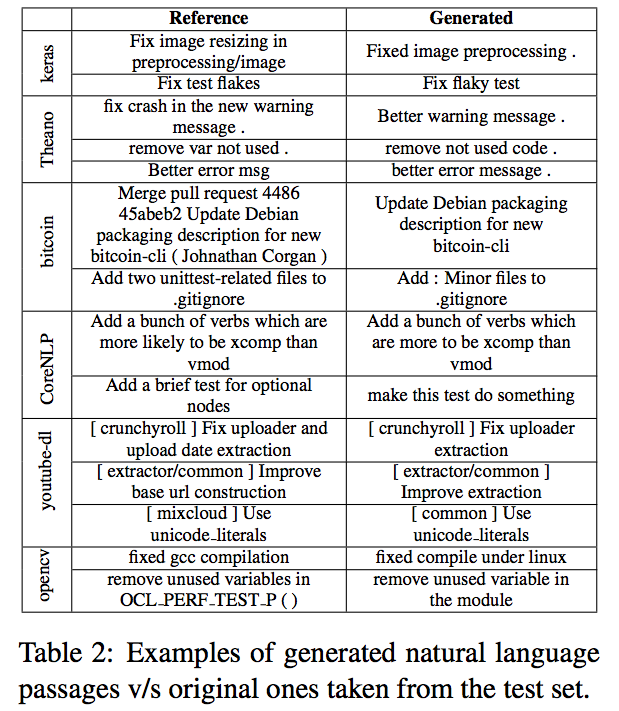

[ACL 2017](http://acl2017.org/) with its nearly 200 full papers and more than 100 short papers was a treasure trove again for inspiring approaches, problems and datasets. There is really only one topic I stay away from and that is parsing - it just does not hold a lot of interest for me. The vast majority of papers contain a strong empirical component and it takes a while to actually find papers whose baselines come from papers written in 2013 or earlier; in fact, many papers resort to just reporting baselines from 2016 and 2017 papers. This is quite a contrast to IR, where the deep neural IR models are routinely compared to classic - and robust - retrieval models from the 1980s and 1990s. Are most of the NLP tasks new or did deep learning kill every single 'classic' baseline?
Compared to [last year](http://chauff.github.io/2016-08-12-acl2016/), I am also seeing fewer "quirky" papers (for the lack of a better word); the vast majority are deep and empirical.

Here are the papers I found most interesting this year - more papers will be added as I make my way through the proceedings:

* [*What do Neural Machine Translation Models Learn about Morphology?*](http://aclweb.org/anthology/P/P17/P17-1080.pdf) is a must-read for anyone who is interested in **analyzing the deep net black box**. The authors take up the challenge for neural machine translation models and explore the impact of several neural design decisions. There should be a paper like this for every model type and task (imho).

* [*FOIL it! Find One mismatch between Image and Language caption*](http://aclweb.org/anthology/P/P17/P17-1024.pdf) takes a closer look at visual question answering (VQA: given an image an a question, generate an answer) and image captioning (IC: given an image, generate a caption) approaches by creating a **diagnostic dataset** based on the [MS-COCO](http://mscoco.org/) benchmark. MS-COCO contains 300K images, each with five(+) different captions, written by crowd workers. VQA and IC approaches achieve great results on this benchmark, but do they truly learn how to answer and caption or do they exploit biases in the dataset? This diagnostic dataset provides more than a few hints that it is actually the latter. The authors take the MS-COCO image/caption pairs as their starting point and introduce a single error (a semantically related but incorrect term) into each caption. They then adapt state-of-the-art IC and VQA approaches for the task of caption classification (correct/foil). These state-of-the-art algorithms are not doing too well at detecting foil captions (accuracy of 45.44 compared to 94.52 that a majority vote of humans achieves), indicating that there is still a long way to go.

* [*On the Challenges of Translating NLP Research into Commercial Products*](http://aclweb.org/anthology/P/P17/P17-2015.pdf) is a short paper that describes the challenges industry faces when it tries to make use of the latest research findings in natural language processing.

* [*Translating Neuralese*](http://aclweb.org/anthology/P/P17/P17-1022.pdf) is included here because of the hip title as well as the question the work tackles. In the words of the authors: *"Several approaches have recently been proposed
for learning decentralized deep multiagent policies that coordinate via a differentiable communication channel. While
these policies are effective for many tasks, interpretation of their induced communication strategies has remained a challenge. Here we propose to interpret agents’ messages by translating them."* 

* [*A Syntactic Neural Model for General-Purpose Code Generation*](http://aclweb.org/anthology/P/P17/P17-1041.pdf) considers *"... the problem of **parsing natural language descriptions into source code** written in a general-purpose programming language like Python... Informed by previous work in semantic parsing, in this paper we propose a novel neural architecture powered by a grammar model to explicitly capture the target syntax as prior knowledge."* Sounds like the dream of every first year student who hates his/her programming class. A description of the problem goes into the system and runnable Python code comes out. Scary to think about as a programming class instructor. The paper shows that this problem cannot be solved with off-the-shelf DL approaches, quite a lot of domain adaptation is required to make it work. The results show that meaningful code generation is possible:    with the caveat that at the moment the input descriptions are short and concise, such as this one from the DJANGO dataset: `join app config.path and string ’locale’ into a file path, substitute it for localedir` which the code generator is able to correctly translate into Python: `localedir = os.path.join(app config.path, ’locale’)`.

* [*A Neural Architecture for Generating Natural Language Descriptions from Source Code Changes*](http://aclweb.org/anthology/P/P17/P17-2045.pdf) is a short paper that does the oppositive of the previous paper: source code goes into the neural net (code commits) and a natural language description (the intended commit message) comes out. While this will not help programming novices, it may eventually help software developers that collaboratively write code for a living and struggle with meaningful commit messages. The paper makes use of data collected through GitHub, the one and only large-scale and open code sharing platform which offers an astonishing amount of data for anyone willing to go through its API. Once more looking at the generated output shows that we have are quite a way from this vision:
 

* [*Get To The Point: Summarization with Pointer-Generator Networks*](http://aclweb.org/anthology/P/P17/P17-1099.pdf) tackles the two issues that have plagued abstractive text summarization (a topic that also is of importance in IR): repetition of content and inaccurate summarization of facts. A paper very focused on the weaknesses of existing methods and how to resolve them in a meaningful way.

* [*Affect-LM: A Neural Language Model for Customizable Affective Text Generation*](http://aclweb.org/anthology/P/P17/P17-1059.pdf) is another paper in the interesting-task category: the proposed model is an extension of the LSTM model (what else?) that *"... **customize[s] the degree of emotional content in generated sentences** through an additional design parameter."* This should come in handy for various dialogue systems that are deployed in affective scenarios - imagine your flight booking system actually reacting empathically to your distress at paying exorbitant luggage fees. We still have some way to go though, as the example sentences generated by the authors' model (with conditioning of the affect category) shows:
 

* [*Learning Character-level Compositionality with Visual Features*](http://aclweb.org/anthology/P/P17/P17-1188.pdf) proposes an approach that makes use of the **appearance of characters** in logographic writing systems (e.g. Kanji characters in Chinese); the pipeline combines RNNs, CNNs and embeddings. A neat idea with all the (by now) 'standard' deep learning goodies.

* [*Program Induction by Rationale Generation: Learning to Solve and Explain Algebraic Word Problems*](http://aclweb.org/anthology/P/P17/P17-1015.pdf) comes out of the labs of Oxford and DeepMind. It considers algebraic word problems such as 
*Two trains running in opposite directions cross a man standing on the platform in 27 seconds and 17 seconds respectively and they cross each other in 23 seconds. The ratio of their speeds is ??* and solves these problems *"by generating answer rationales, sequences of natural language and human-readable mathematical expressions that derive the final answer through a series of small steps"*. In contrast to prior works, deriving the answer rationale is part of the solution pipeline and not an afterthought. For this work, the authors collected a dataset with 100,000 problems (annotated with question/options/rationale/correct-option) based on 34K seed problems from GRE/GMAT websites and an additional generate-similar-problems crowdsourcing step. As the problems are restricted to algebraic word problems, the deep net is designed with this specific restricted domain in mind. Once more a great example of domain adaptation in the realm of deep learning.

* [*Understanding Task Design Trade-offs in Crowdsourced Paraphrase Collection*](http://aclweb.org/anthology/P/P17/P17-2017.pdf) is a short paper that provides a good example of how to explore the design space of crowdsourcing tasks to ensure that the collected data is of high quality, diverse and accurate. The authors focus on the collection of paraphrases (*Given sentence X, write n sentences that express the same meaning in different ways.*) and investigate variations in instructions, incentives, data domains and workflows. 

* One of the - to me - fascinating areas of ACL are the **language construction and language evolution** studies. [*Naturalizing a Programming Language via Interactive Learning*](http://aclweb.org/anthology/P/P17/P17-1086.pdf) from Stanford falls into this category. The authors built [`Voxelturn`](http://www.voxelurn.com/#/about), a command-line system to create voxel structures such as these one:
  
and starting from a core programming language, allowed their users to "naturalize" the language by defining an alternative, more natural syntax. The experiment ran on MTurk (*Why do I never get to see those interesting HITS?*) and within a few days their user community had turned the core programming language into a high-level language.

* [*TriviaQA: A Large Scale Distantly Supervised Challenge Dataset for Reading Comprehension*](http://aclweb.org/anthology/P/P17/P17-1147.pdf) introduces [`TriviaQA`](http://nlp.cs.washington.edu/triviaqa/index.html), a **question-answer-evidence dataset** with  with more than 95K question-answer pairs authored by trivia enthusiasts and independently gathered evidence
documents (from the Web and Wikipedia), six per question on average. The paper also contains a shout-out to TREC and the TREC-8 Question Answering track which was already released in the year 2000:
  
A first analysis by the authors indicates that this is a considerably more difficult dataset than [SQUAD](https://rajpurkar.github.io/SQuAD-explorer/), the Stanford Question Answering Dataset, currently one of the main benchmarks for reading comprehension. Some of `TriviaQA`'s questions remind me of the old [A Google A Day](https://en.wikipedia.org/wiki/A_Google_A_Day) quizzes, e.g. *A mill in Woodbridge, Suffolk, England, built in the 12th century, reconstructed in 1792, further restored in 2010 and currently in full working order is a early English example of a mill powered by what?*.

* [*Reading Wikipedia to Answer Open-Domain Questions*](http://aclweb.org/anthology/P/P17/P17-1171.pdf) comes out of Facebook's AI research lab and attempts to answer any factoid question with text snippet from a Wikipedia article. One of the few papers at ACL that includes an IR component (retrieving the Wikipedia articles relevant to a question) as part of their pipeline.

