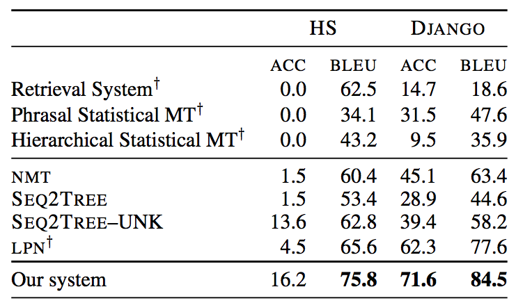
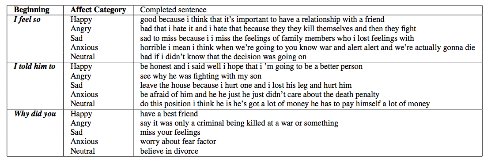

[ACL 2017](http://acl2017.org/) with its nearly 200 full papers and more than 100 short papers was a treasure trove again for inspiring approaches, problems and datasets. There is really only one topic I stay away from and that is parsing - it just does not hold a lot of interest for me. Here are the papers I found most interesting this year:

* [*FOIL it! Find One mismatch between Image and Language caption*](http://aclweb.org/anthology/P/P17/P17-1024.pdf) takes a closer look at visual question answering (VQA: given an image an a question, generate an answer) and image captioning (IC: given an image, generate a caption) approaches by creating a **diagnostic dataset** based on the [MS-COCO](http://mscoco.org/) benchmark. MS-COCO contains 300K images, each with five(+) different captions, written by crowd workers. VQA and IC approaches achieve great results on this benchmark, but do they truly learn how to answer and caption or do they exploit biases in the dataset? This diagnostic dataset provides more than a few hints that it is actually the latter. The authors take the MS-COCO image/caption pairs as their starting point and introduce a single error (a semantically related but incorrect term) into each caption. They then adapt state-of-the-art IC and VQA approaches for the task of caption classification (correct/foil). These state-of-the-art algorithms are not doing too well at detecting foil captions (accuracy of 45.44 compared to 94.52 that a majority vote of humans achieves), indicating that there is still a long way to go.

* [*A Syntactic Neural Model for General-Purpose Code Generation*](http://aclweb.org/anthology/P/P17/P17-1041.pdf) considers *"... the problem of **parsing natural language descriptions into source code** written in a general-purpose programming language like Python... Informed by previous work in semantic parsing, in this paper we propose a novel neural architecture powered by a grammar model to explicitly capture the target syntax as prior knowledge."* Sounds like the dream of every first year student who hates his/her programming class. A description of the problem goes into the system and runnable Python code comes out. Scary to think about as a programming class instructor. The paper shows that this problem cannot be solved with off-the-shelf DL approaches, quite a lot of domain adaptation is required to make it work. The results show that meaningful code generation is possible:    with the caveat that at the moment the input descriptions are short and concise, such as this one from the DJANGO dataset: `join app config.path and string ’locale’ into a file path, substitute it for localedir` which the code generator is able to correctly translate into Python: `localedir = os.path.join(app config.path, ’locale’)`.

* [*Affect-LM: A Neural Language Model for Customizable Affective Text Generation*](http://aclweb.org/anthology/P/P17/P17-1059.pdf) is another paper in the interesting-task category: the proposed model is an extension of the LSTM model (what else?) that *"... customize[s] the degree of emotional content in generated sentences through an additional design parameter."* This should come in handy for various dialogue systems that are deployed in affective scenarios - imagine your flight booking system actually reacting empathically to your distress at paying exorbitant luggage fees. We are not quite there yet, as the example sentences generated by the authors' model (with conditioning of the affect category) shows:
 
