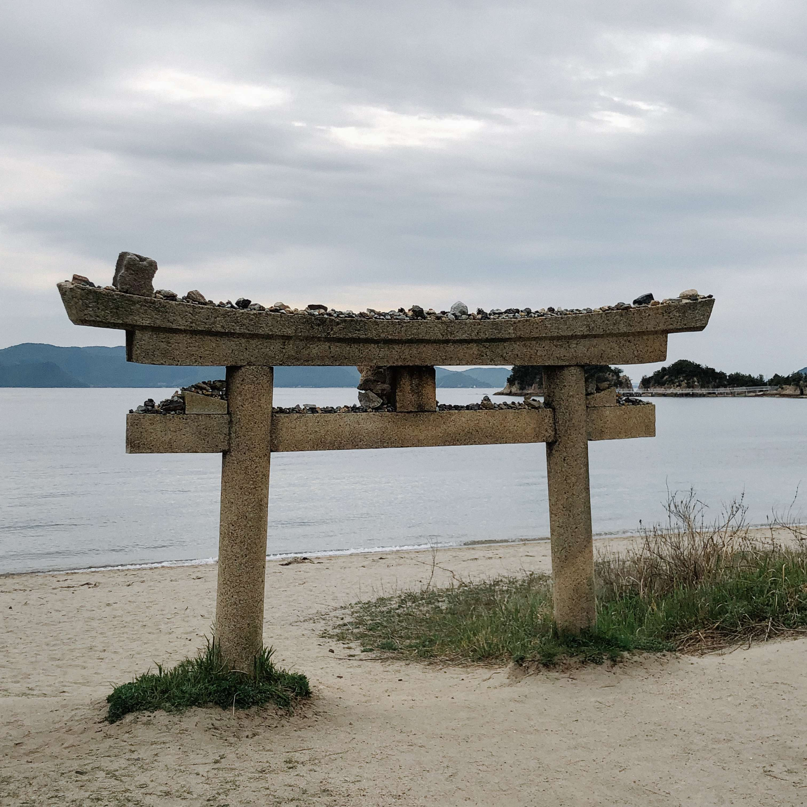
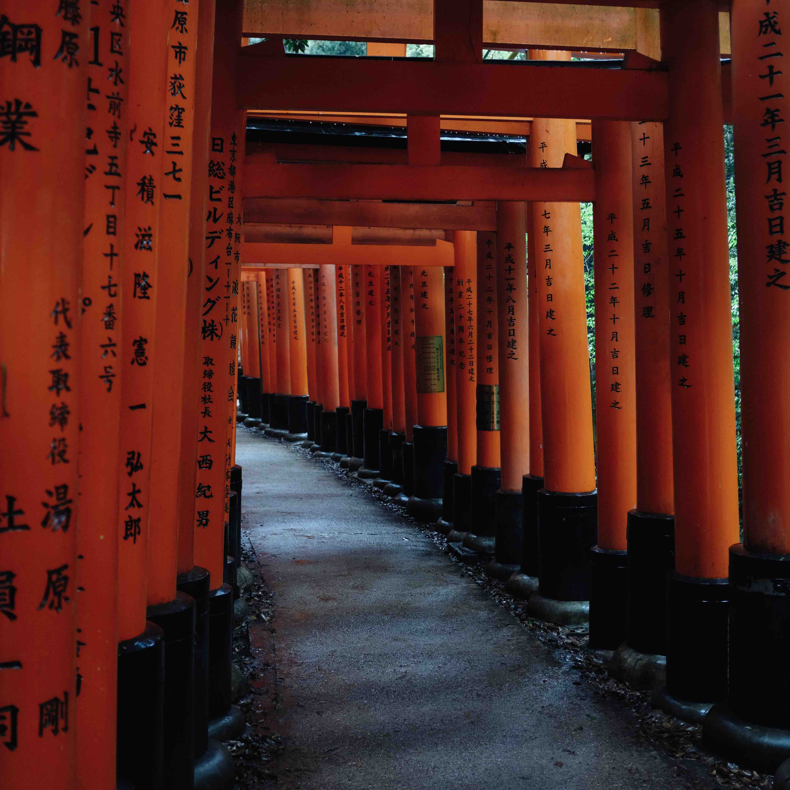
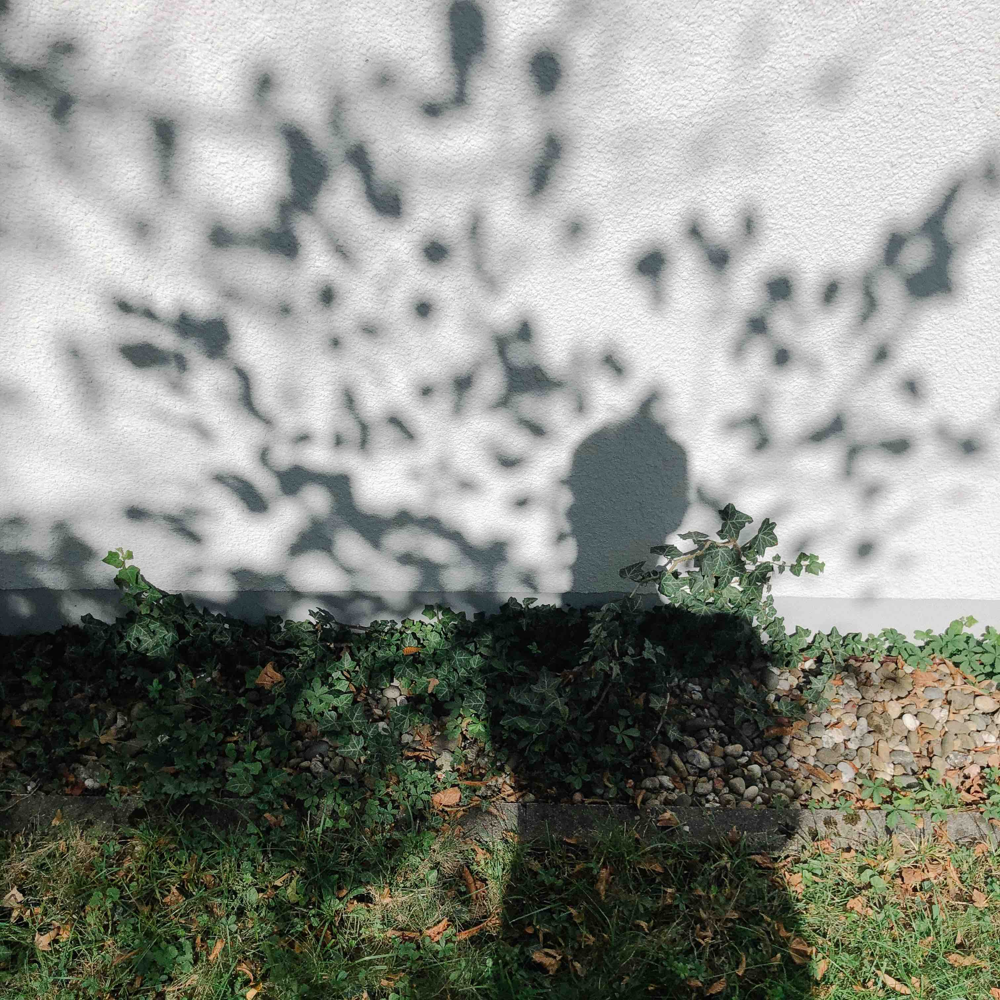

    
    

    
    

“清歌唱宛转，春雨过铃鹿。”  —— 夏目漱石

A Research Associate in Steinbuch Centre for Computing and Department of Mathematics at Karlsruhe Institute of Technology.
I received my doctorate in Fluid Mechanics from Peking University,
and I worked as a Research Assistant in Department of Mathematics at Hong Kong University of Science and Technology.

My research interest includes 1) hyperbolic conservation laws, kinetic theory of gases and uncertainty quantification; 2) multiscale modeling and computational study of fluid mechanics, photon transports and plasma physics; 3) neural network and its application in solving nonlinear differential equations.
I can also be found on [Google Scholar](https://scholar.google.com/citations?user=wFTQeXwAAAAJ&hl=en&oi=ao) and [ResearchGate](https://www.researchgate.net/profile/Tianbai_Xiao).

I guess we could sit down and talk something about artistic photography as amateur.
