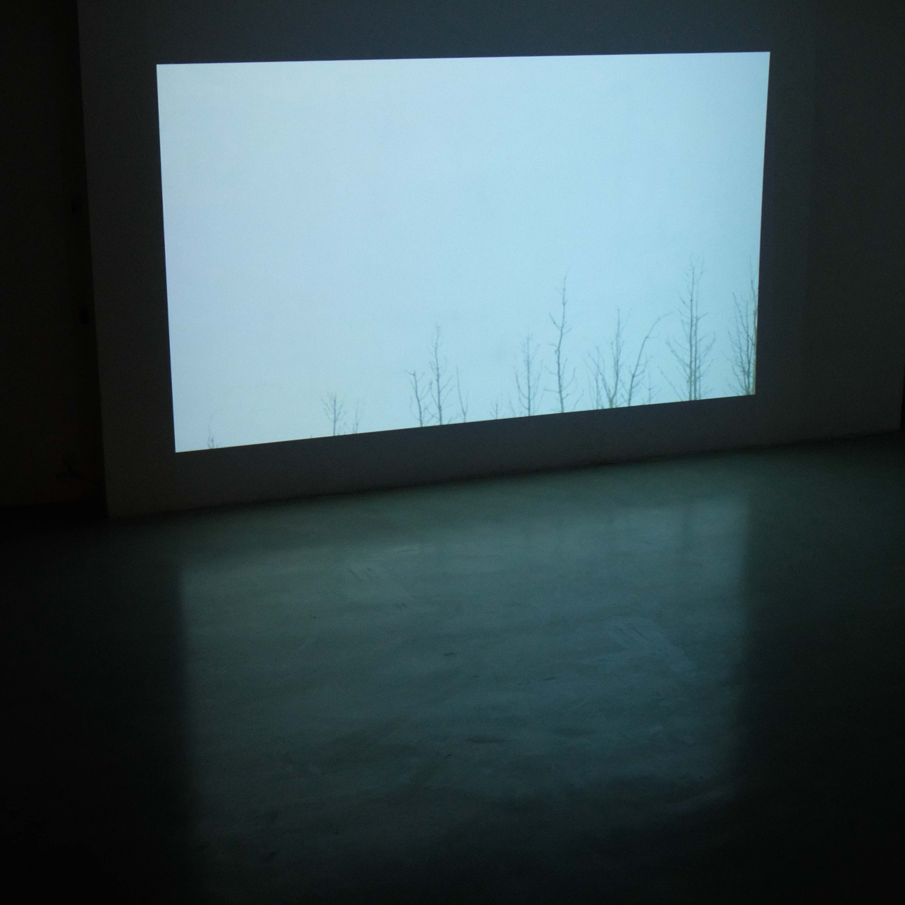

    
    

    
    

“世界尚幼稚，如浮脂然，如水母然，漂浮不定之时，有物如芦芽萌长，便化为神。” 

I received my doctorate in Fluid Mechanics from Peking University, and now work in Department of Mathematics at Karlsruhe Institute of Technology. I can be found on [Google Scholar](https://scholar.google.com/citations?user=wFTQeXwAAAAJ&hl=en&oi=ao) and [ResearchGate](https://www.researchgate.net/profile/Tianbai_Xiao).

Sometimes I do photography. I guess art is what gets lost in talk.